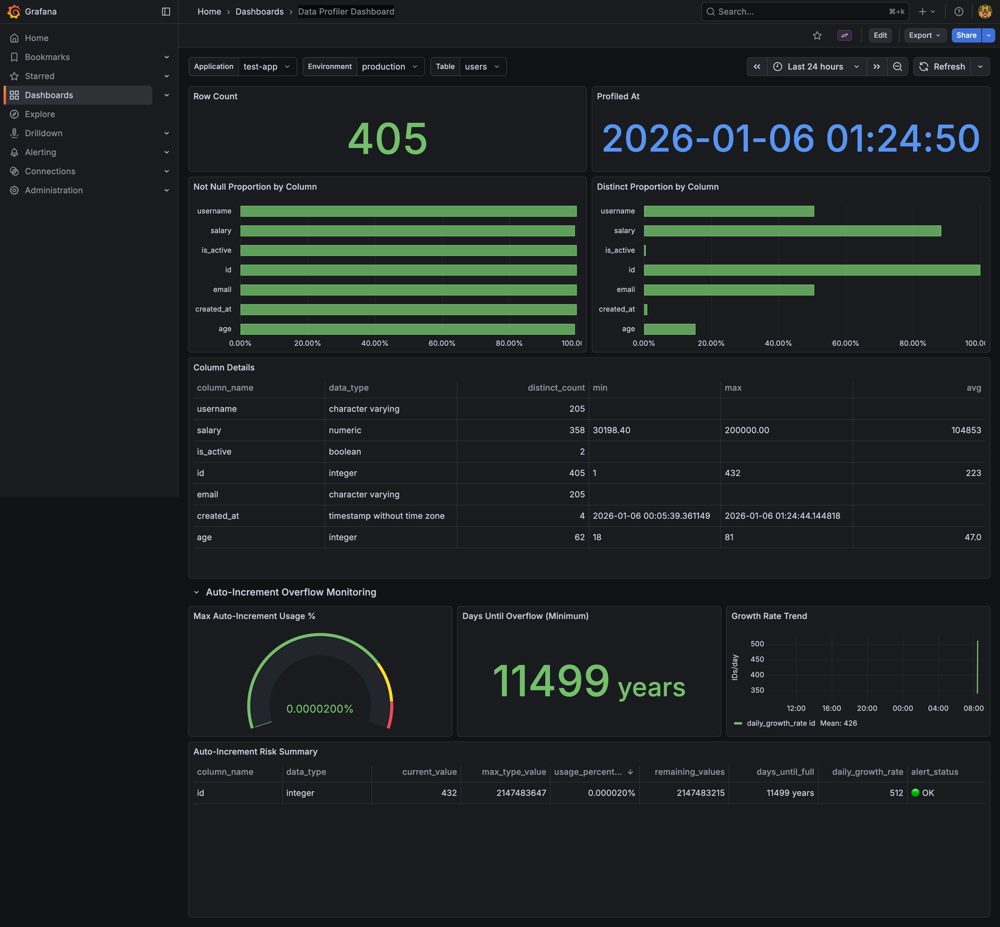
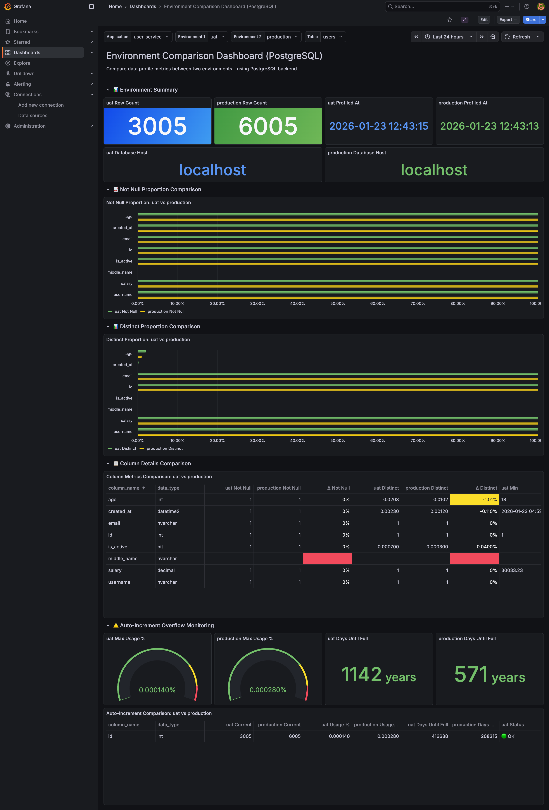

🌐 **Language:** **English** | [ภาษาไทย](README.th.md)

# DataProfiler

Automated **Data Profiling** tool for **PostgreSQL** and **Microsoft SQL Server** with [dbt-profiler](https://github.com/data-mie/dbt-profiler) style metrics, storing results in ClickHouse.


## 🎯 Overview

DataProfiler provides:

1. **Multi-Database Support**: PostgreSQL and Microsoft SQL Server (Azure SQL Edge)
2. **Automatic Schema Discovery** from source databases (information_schema)
3. **dbt-profiler Style Metrics** calculation via SQL queries
4. **Result Storage** in ClickHouse for analysis and tracking
5. **Multiple Export Formats**: Markdown, JSON, CSV, Console Table
6. **Web Dashboard** for data visualization (React + TailwindCSS)
7. **Auto-Increment Overflow Risk Analysis** with growth prediction using Linear Regression

## 📊 Profiled Metrics

For each column, the system collects the following statistics (dbt-profiler compatible):

| Metric                | Description                                 | Condition             |
| --------------------- | ------------------------------------------- | --------------------- |
| `column_name`         | Column name                                 | All columns           |
| `data_type`           | Data type                                   | All columns           |
| `not_null_proportion` | Proportion of non-NULL values (0.00 - 1.00) | All columns           |
| `distinct_proportion` | Proportion of unique values (0.00 - 1.00)   | All columns           |
| `distinct_count`      | Count of unique values                      | All columns           |
| `is_unique`           | Whether all values are unique (true/false)  | All columns           |
| `min` / `max`         | Minimum / Maximum values                    | numeric, date, time\* |
| `avg`                 | Average value                               | numeric\*\*           |
| `median`              | Median value                                | numeric\*\*           |
| `std_dev_population`  | Population standard deviation               | numeric\*\*           |
| `std_dev_sample`      | Sample standard deviation                   | numeric\*\*           |
| `profiled_at`         | Profile timestamp                           | All columns           |

> **\*** `min`/`max` supported for: integer, numeric, float, date, timestamp, time  
> **\*\*** `avg`, `median`, `std_dev` supported for: integer, numeric, float

## 🔮 Auto-Increment Overflow Risk Analysis

DataProfiler includes **Auto-Increment Column Overflow Risk Analysis** to predict when primary key columns will reach their maximum capacity.

### Features

- **Current Value Tracking**: Monitors the current value of auto-increment columns
- **Maximum Value Calculation**: Computes the max value based on data type (e.g., INT, BIGINT)
- **Usage Percentage**: Calculates current capacity usage
- **Growth Rate Prediction**: Uses Linear Regression on historical data from ClickHouse
- **Days Until Full**: Predicts when the column will reach maximum capacity
- **Alert Status**: CRITICAL (< 30 days / > 90%), WARNING (< 90 days / > 75%), NORMAL

### Supported Data Types

| Data Type   | Max Value                 | Range                               |
| ----------- | ------------------------- | ----------------------------------- |
| `smallint`  | 32,767                    | -32,768 to 32,767                   |
| `integer`   | 2,147,483,647             | -2.1B to 2.1B                       |
| `bigint`    | 9,223,372,036,854,775,807 | -9.2 quintillion to 9.2 quintillion |
| `serial`    | 2,147,483,647             | 1 to 2.1B                           |
| `bigserial` | 9,223,372,036,854,775,807 | 1 to 9.2 quintillion                |

#### MSSQL Data Types

| Data Type  | Max Value                 | Range                               |
| ---------- | ------------------------- | ----------------------------------- |
| `tinyint`  | 255                       | 0 to 255                            |
| `smallint` | 32,767                    | -32,768 to 32,767                   |
| `int`      | 2,147,483,647             | -2.1B to 2.1B                       |
| `bigint`   | 9,223,372,036,854,775,807 | -9.2 quintillion to 9.2 quintillion |

> **Note**: Supports both PostgreSQL SERIAL/BIGSERIAL/IDENTITY columns and MSSQL IDENTITY columns.

### Usage

```bash
# PostgreSQL (default)
python main.py users --auto-increment

# MSSQL
python main.py test_users -d mssql --auto-increment

# With custom lookback period (default: 7 days)
python main.py users --auto-increment --lookback-days 14

# With application and environment context
python main.py users --app order-service --env production --auto-increment
```

### Output Example

```
============================================================
AUTO-INCREMENT OVERFLOW RISK ANALYSIS
============================================================

🟢 users.id (integer)
   Current: 1,234,567 / 2,147,483,647
   Usage: 0.057479%
   Days until full: 4,521 days
   Growth rate: ~500 IDs/day
============================================================
```

## 🛠️ Requirements

- Python 3.10+
- PostgreSQL and/or Microsoft SQL Server (Azure SQL Edge for ARM64/M1)
- ClickHouse
- Dependencies:
  - `psycopg2` - PostgreSQL adapter
  - `pymssql` - MSSQL adapter
  - `clickhouse-connect` - ClickHouse client
  - `soda-core-postgres` - Soda Core for PostgreSQL
  - `soda-core-sqlserver` - Soda Core for SQL Server
  - `jinja2` - Template engine
  - `python-dotenv` - Environment variable management
  - `numpy` - Numerical computing
  - `scipy` - Scientific computing (Linear Regression)

## 📦 Installation

1. Clone repository:

```bash
git clone <repository-url>
cd DataProfiler
```

2. Create and activate Virtual Environment:

```bash
# Create venv
python -m venv venv

# Activate (macOS/Linux)
source venv/bin/activate

# Activate (Windows)
venv\Scripts\activate
```

3. Install dependencies:

```bash
pip install -r requirements.txt
```

## ⚙️ Configuration

### 1. Create Environment Variables File

Copy `.env.example` to `.env` and edit values:

```bash
cp .env.example .env
```

Edit `.env` file:

```bash
# PostgreSQL Configuration
POSTGRES_HOST=localhost
POSTGRES_PORT=5432
POSTGRES_DATABASE=postgres
POSTGRES_USER=postgres
POSTGRES_PASSWORD=your_actual_password
POSTGRES_SCHEMA=public

# ClickHouse Configuration
CLICKHOUSE_HOST=localhost
CLICKHOUSE_PORT=8123
CLICKHOUSE_USER=default
CLICKHOUSE_PASSWORD=your_actual_password
```

> ⚠️ **Important:** The `.env` file is already git-ignored. No need to worry about committing credentials.

### 2. Soda Core Configuration

Edit `configuration.yml` for Soda Core:

```yaml
data_source my_postgres:
  type: postgres
  host: ${POSTGRES_HOST}
  port: ${POSTGRES_PORT}
  username: ${POSTGRES_USER}
  password: ${POSTGRES_PASSWORD}
  database: ${POSTGRES_DATABASE}
  schema: ${POSTGRES_SCHEMA}

data_source my_mssql:
  type: sqlserver
  host: ${MSSQL_HOST}
  port: ${MSSQL_PORT}
  username: ${MSSQL_USER}
  password: ${MSSQL_PASSWORD}
  database: ${MSSQL_DATABASE}
  schema: ${MSSQL_SCHEMA}
```

## 🚀 Usage

### Basic Usage

```bash
# Profile 'users' table from PostgreSQL (default)
python main.py users

# Profile from MSSQL
python main.py test_users -d mssql

# Profile with Application & Environment context
python main.py users --app order-service --env uat
python main.py users --app order-service --env production

# Profile a specific table
python main.py products
```

### Output Formats

```bash
# Console table (default)
python main.py users --format table

# Markdown (dbt-profiler style)
python main.py users --format markdown

# JSON
python main.py users --format json

# CSV
python main.py users --format csv
```

### Save to File

```bash
python main.py users --format markdown --output profiles/users.md
python main.py users --format json --output profiles/users.json
python main.py users --format csv --output profiles/users.csv
```

### Additional Options

```bash
# Skip storing to ClickHouse
python main.py users --no-store

# Verbose logging
python main.py users -v

# Select database type
python main.py test_users -d mssql           # Use MSSQL
python main.py users -d postgresql            # Use PostgreSQL (default)

# Include auto-increment overflow analysis
python main.py users --auto-increment
python main.py test_users -d mssql --auto-increment

# Custom lookback period for growth calculation
python main.py users --auto-increment --lookback-days 14

# Show help
python main.py --help
```

## 📁 Project Structure

```
DataProfiler/
├── .env.example              # Environment variables template
├── .env                      # Environment variables (git ignored)
├── .gitignore                # Git ignore rules
├── LICENSE                   # Apache 2.0 License
├── configuration.yml         # Soda Core data source configuration
├── docker-compose.yml        # Docker full stack environment
├── main.py                   # Main entry point
├── pytest.ini                # Pytest configuration
├── README.md                 # Documentation (English)
├── README.th.md              # Documentation (Thai)
├── requirements.txt          # Python dependencies
│
├── dashboard/                # Web Dashboard
│   ├── backend/              # Flask API server
│   │   ├── app.py            # API endpoints
│   │   └── requirements.txt  # Backend dependencies
│   └── frontend/             # React + Vite frontend
│       ├── src/
│       │   └── App.jsx       # Main React component
│       ├── package.json
│       └── nginx.conf        # Production nginx config
│
├── docs/                     # Documentation assets
│   └── images/               # Dashboard screenshots
│
├── grafana/                  # Grafana dashboards & config
│   ├── dashboards/
│   │   ├── main_dashboard.json               # Single environment view
│   │   └── env_comparison_dashboard.json     # Environment comparison
│   └── provisioning/
│       ├── dashboards/dashboard.yml
│       └── datasources/datasource.yml
│
├── init-scripts/             # PostgreSQL & ClickHouse init scripts
│   └── 01-sample-data.sql    # Sample data for testing
│
├── src/                      # Source code modules
│   ├── __init__.py
│   ├── config.py             # Configuration management
│   ├── exceptions.py         # Custom exceptions
│   ├── core/                 # Core profiling logic
│   │   ├── __init__.py
│   │   ├── autoincrement_metrics.py  # Auto-increment analysis
│   │   ├── formatters.py     # Output formatters (MD, JSON, CSV)
│   │   ├── metrics.py        # dbt-profiler style metrics
│   │   └── profiler.py       # Legacy Soda Core profiler
│   └── db/                   # Database connections
│       ├── __init__.py
│       ├── autoincrement.py  # Auto-increment detector (PostgreSQL & MSSQL)
│       ├── clickhouse.py     # ClickHouse client
│       ├── connection_factory.py  # Multi-database factory
│       ├── mssql.py          # MSSQL client
│       └── postgres.py       # PostgreSQL client
│
├── tests/                    # Unit tests
│   ├── __init__.py
│   ├── test_autoincrement.py
│   ├── test_config.py
│   ├── test_connections.py
│   ├── test_metadata.py
│   └── test_profiler.py
│
└── venv/                     # Python virtual environment (git ignored)
```

## 🧪 Testing

```bash
# Activate virtual environment
source venv/bin/activate

# Run tests
pytest

# Run with verbose output
pytest -v

# Run with coverage report
pytest --cov=src --cov-report=term-missing
```

## 🐳 Docker Full Stack Environment

This project is fully containerized. You can spin up the entire stack (DBs, Backend, Frontend, Grafana) with one command.

```bash
# Start all services
docker-compose up -d --build
```

### Services Overview

| Service        | URL / Port            | Description                          |
| -------------- | --------------------- | ------------------------------------ |
| **Frontend**   | http://localhost:8080 | Main Data Profiler Dashboard (React) |
| **Grafana**    | http://localhost:3000 | Advanced Visualization (Admin)       |
| **Backend**    | Internal (5001)       | API Service (Flask)                  |
| **ClickHouse** | localhost:8123        | HTTP Interface                       |
| **PostgreSQL** | localhost:5432        | Source Database                      |
| **MSSQL**      | localhost:1433        | Source Database (Azure SQL Edge)     |

### Credentials

- **Grafana**: User: `admin`, Pass: `admin` (or set via `GRAFANA_ADMIN_PASSWORD` in .env)
- **PostgreSQL**: User: `postgres`, Pass: `password123`
- **MSSQL**: User: `sa`, Pass: `YourStrong@Password123`
- **ClickHouse**: User: `default`, Pass: `password123`

### Starting MSSQL (Azure SQL Edge)

MSSQL uses Azure SQL Edge for ARM64/M1 compatibility:

```bash
# Start MSSQL container
docker compose up -d mssql

# Wait ~30 seconds for startup, then initialize database
python init-scripts/init-mssql.py

# Test profiler
python main.py test_users -d mssql --no-store
```

> **Note**: Azure SQL Edge doesn't run init scripts automatically like PostgreSQL. Use the Python script to create test databases.

### Sample Data & Testing

Docker automatically creates sample data in PostgreSQL with **100+ records** for both `users` and `products` tables.

#### 1. Generate Additional Sample Data

To add more test data for auto-increment growth rate calculation:

```bash
# Add 100 new users to PostgreSQL
docker exec dataprofiler-postgres psql -U postgres -d postgres -c "
INSERT INTO users (username, email, age, salary, is_active)
SELECT
  'newuser_' || generate_series,
  'newuser' || generate_series || '@test.com',
  (random()*60+18)::int,
  (random()*150000+30000)::numeric(10,2),
  random() > 0.2
FROM generate_series(1, 100);
"

# Add 50 new products
docker exec dataprofiler-postgres psql -U postgres -d postgres -c "
INSERT INTO products (name, description, price, stock_quantity, is_available)
SELECT
  'Product_' || generate_series,
  'Description for product ' || generate_series,
  (random()*1000+10)::numeric(10,2),
  (random()*500)::int,
  random() > 0.1
FROM generate_series(1, 50);
"
```

#### 2. Run Data Profiler

Profile tables with application and environment context:

```bash
# Activate virtual environment
source venv/bin/activate

# Profile 'users' table for UAT environment
python main.py users --app order-service --env uat

# Profile 'users' table for Production environment
python main.py users --app order-service --env production

# Profile with auto-increment overflow analysis
python main.py users --app order-service --env production --auto-increment

# Profile 'products' table with all options
python main.py products --app order-service --env production --auto-increment
```

#### 3. Using Docker (Alternative)

```bash
# Run profiler inside backend container
docker-compose exec backend python ../main.py users --app order-service --env production --auto-increment
```

#### 4. View Results

- **React Dashboard**: http://localhost:8080
- **Grafana Dashboard**: http://localhost:3000

> **Tip**: Run the profiler multiple times after inserting new data to enable `Days Until Full` calculation for auto-increment columns.

### Stop Services

```bash
docker-compose down -v  # Stop and remove volumes
```

## 📊 Dashboard Development

If you want to run the dashboard manually (outside Docker) for development:

```bash
# 1. Start Backend API
cd dashboard/backend
python app.py

# 2. Start Frontend
cd dashboard/frontend
npm run dev
# Access at http://localhost:5173
```

### Technology Stack

| Component | Technology         |
| --------- | ------------------ |
| Backend   | Flask + Flask-CORS |
| Frontend  | React + Vite       |
| Styling   | TailwindCSS        |
| Charts    | Recharts           |

### Environment Comparison Dashboard

The dashboard supports **dual-environment comparison** to compare data profiles between environments (e.g., UAT vs Production).


#### Features

- **Dual Environment Selectors**: Select two environments to compare side-by-side
- **Summary Panel**: Shows row counts and profiling timestamps for both environments
- **Comparison Charts**: Side-by-side bar charts for Not Null Proportion and Distinct Proportion
- **Difference Highlighting**: Color-coded differences (green = improvement, red = degradation)
- **Min/Max Filtering**: Shows min/max values only for numeric and date/time columns (matches backend logic)
- **Auto-Increment Comparison**: Compare overflow risk metrics between environments

#### API Endpoints

| Endpoint                                                                   | Description                                  |
| -------------------------------------------------------------------------- | -------------------------------------------- |
| `GET /api/metadata`                                                        | List all applications and their environments |
| `GET /api/profiles/compare/<table>?app=<app>&env1=<env1>&env2=<env2>`      | Compare profiles between two environments    |
| `GET /api/autoincrement/compare/<table>?app=<app>&env1=<env1>&env2=<env2>` | Compare auto-increment metrics               |

## 📈 Grafana Dashboard (Alternative)

This project includes a **Grafana** instance connected to ClickHouse for advanced visualization.



### Features

- **Direct ClickHouse Integration**: No middleware required.
- **Customizable**: Create complex dashboards with SQL queries.
- **Alerting**: Native Grafana alerting support.
- **User Management**: Role-based access control.

### Pre-Provisioned Dashboards

Two dashboards are automatically provisioned:

| Dashboard                            | Description                                                                               |
| ------------------------------------ | ----------------------------------------------------------------------------------------- |
| **Main Dashboard**                   | Single environment view with data profiles, column details, and auto-increment monitoring |
| **Environment Comparison Dashboard** | Compare profiles between two environments side-by-side with difference highlighting       |



### Setup

The Grafana service is included in `docker-compose.yml` and pre-configured with the ClickHouse datasource.

1. Start all services:

   ```bash
   docker-compose up -d
   ```

2. Open Grafana:

   - URL: http://localhost:3000
   - User: `admin`
   - Password: `admin`

3. Select a Dashboard:
   - Go to **Dashboards** menu
   - Choose **Main Dashboard** or **Environment Comparison Dashboard**
   - Select Application, Environment(s), and Table from dropdowns

## 📝 License

This project is licensed under the [Apache License 2.0](LICENSE).

```
Copyright 2024-2026 DataProfiler Contributors

Licensed under the Apache License, Version 2.0 (the "License");
you may not use this file except in compliance with the License.
You may obtain a copy of the License at

    http://www.apache.org/licenses/LICENSE-2.0

Unless required by applicable law or agreed to in writing, software
distributed under the License is distributed on an "AS IS" BASIS,
WITHOUT WARRANTIES OR CONDITIONS OF ANY KIND, either express or implied.
See the License for the specific language governing permissions and
limitations under the License.
```

## 🤝 Contributing

Pull requests are welcome! For major changes, please open an issue first to discuss.
