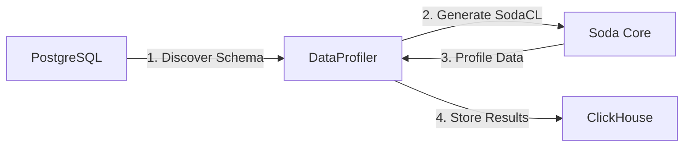

# DataProfiler

เครื่องมือสำหรับทำ **Data Profiling** อัตโนมัติจาก PostgreSQL โดยใช้ [Soda Core](https://www.soda.io/) และจัดเก็บผลลัพธ์ลง ClickHouse

## 🎯 ภาพรวม

DataProfiler ทำหน้าที่:

1. **ดึงข้อมูล Schema** อัตโนมัติจาก PostgreSQL (information_schema)
2. **สแกนและวิเคราะห์** ข้อมูลในตารางด้วย Soda Core
3. **จัดเก็บผลลัพธ์** การ Profile ลง ClickHouse เพื่อการวิเคราะห์และติดตาม

## 📊 ข้อมูลที่ Profile

สำหรับแต่ละ Column ระบบจะเก็บข้อมูลสถิติดังนี้:

| Metric           | คำอธิบาย                        |
| ---------------- | ------------------------------- |
| `distinct_count` | จำนวนค่าที่ไม่ซ้ำกัน            |
| `missing_count`  | จำนวนค่าที่เป็น NULL            |
| `min`            | ค่าต่ำสุด                       |
| `max`            | ค่าสูงสุด                       |
| `avg`            | ค่าเฉลี่ย (เฉพาะ numeric types) |

## 🛠️ Requirements

- Python 3.10+
- PostgreSQL
- ClickHouse
- Dependencies:
  - `psycopg2` - PostgreSQL adapter
  - `clickhouse-connect` - ClickHouse client
  - `soda-core-postgres` - Soda Core for PostgreSQL
  - `jinja2` - Template engine
  - `python-dotenv` - Environment variable management

## 📦 Installation

1. Clone repository:

```bash
git clone <repository-url>
cd DataProfiler
```

2. สร้าง Virtual Environment และ Activate:

```bash
# สร้าง venv
python -m venv venv

# Activate (macOS/Linux)
source venv/bin/activate

# Activate (Windows)
venv\Scripts\activate
```

3. ติดตั้ง Dependencies จาก requirements.txt:

```bash
pip install -r requirements.txt
```

> **หมายเหตุ:** หากต้องการอัปเดต dependencies ให้รัน `pip install -r requirements.txt --upgrade`

## ⚙️ Configuration

### 1. สร้างไฟล์ Environment Variables

คัดลอก `.env.example` เป็น `.env` และแก้ไขค่าตามจริง:

```bash
cp .env.example .env
```

แก้ไขไฟล์ `.env`:

```bash
# PostgreSQL Configuration
POSTGRES_HOST=localhost
POSTGRES_PORT=5432
POSTGRES_DATABASE=postgres
POSTGRES_USER=postgres
POSTGRES_PASSWORD=your_actual_password
POSTGRES_SCHEMA=public

# ClickHouse Configuration
CLICKHOUSE_HOST=localhost
CLICKHOUSE_PORT=8123
CLICKHOUSE_USER=default
CLICKHOUSE_PASSWORD=your_actual_password
```

> ⚠️ **สำคัญ:** ไฟล์ `.env` ถูก ignore โดย git อยู่แล้ว ไม่ต้องกังวลเรื่อง commit credentials

### 2. Soda Core Configuration

แก้ไขไฟล์ `configuration.yml` สำหรับ Soda Core:

```yaml
data_source my_postgres:
  type: postgres
  host: ${POSTGRES_HOST}
  port: ${POSTGRES_PORT}
  username: ${POSTGRES_USER}
  password: ${POSTGRES_PASSWORD}
  database: ${POSTGRES_DATABASE}
  schema: ${POSTGRES_SCHEMA}
```

## 🚀 Usage

### รันแบบ Default

```bash
python main.py
```

ระบบจะ Profile ตาราง `users` เป็นค่าเริ่มต้น

### ระบุชื่อตาราง

```bash
python main.py <table_name>
```

**ตัวอย่าง:**

```bash
python main.py customers
python main.py orders
```

## 📁 Project Structure

```
DataProfiler/
├── .env.example           # Environment variables template
├── .env                   # Environment variables (git ignored)
├── .gitignore             # Git ignore rules
├── configuration.yml      # Soda Core data source configuration
├── docker-compose.yml     # Docker test environment
├── main.py                # Main entry point
├── init-scripts/          # PostgreSQL init scripts
│   └── 01-sample-data.sql
├── pytest.ini             # Pytest configuration
├── README.md              # Documentation
├── requirements.txt       # Python dependencies
├── src/                   # Source code modules
│   ├── __init__.py
│   ├── config.py          # Configuration management
│   ├── exceptions.py      # Custom exceptions
│   ├── core/              # Core profiling logic
│   │   ├── __init__.py
│   │   └── profiler.py
│   └── db/                # Database connections
│       ├── __init__.py
│       ├── clickhouse.py
│       └── postgres.py
├── tests/                 # Unit tests (37 tests)
│   ├── __init__.py
│   ├── test_config.py
│   ├── test_connections.py
│   ├── test_metadata.py
│   └── test_profiler.py
└── venv/                  # Python virtual environment (git ignored)
```

## 🧪 Testing

### Run All Tests

```bash
# Activate virtual environment
source venv/bin/activate

# Run tests
pytest

# Run with verbose output
pytest -v

# Run with coverage report
pytest --cov=src --cov-report=term-missing
```

### Test Coverage

Current coverage: **37 tests** across 4 test modules

## 🔄 Workflow



1. **Schema Discovery** - ดึงข้อมูล Column และ Data Type จาก `information_schema`
2. **Template Generation** - สร้าง SodaCL YAML แบบ Dynamic ด้วย Jinja2
3. **Data Profiling** - Soda Core สแกนและเก็บสถิติ
4. **Result Storage** - บันทึกผลลัพธ์ลง ClickHouse table `data_profiles`

## 🐳 Docker Development Environment

สำหรับการทดสอบ สามารถใช้ Docker Compose เพื่อสร้าง PostgreSQL และ ClickHouse:

### เริ่มต้น Services

```bash
# Start ทุก services
docker-compose up -d

# ดู logs
docker-compose logs -f

# ตรวจสอบสถานะ
docker-compose ps
```

### Sample Data

Docker จะสร้างข้อมูลตัวอย่างโดยอัตโนมัติ:

| ตาราง      | รายละเอียด                                             |
| ---------- | ------------------------------------------------------ |
| `users`    | 10 records - ข้อมูลผู้ใช้ (มี NULL values สำหรับทดสอบ) |
| `products` | 8 records - ข้อมูลสินค้า                               |

### ทดสอบ DataProfiler

```bash
# Profile ตาราง users
python main.py users

# Profile ตาราง products
python main.py products
```

### หยุด Services

```bash
# Stop ทุก services
docker-compose down

# Stop และลบข้อมูลทั้งหมด
docker-compose down -v
```

## 📋 ClickHouse Schema

ตาราง `data_profiles` ที่ระบบสร้างอัตโนมัติ:

```sql
CREATE TABLE data_profiles (
    scan_time DateTime DEFAULT now(),
    table_name String,
    column_name String,
    distinct_count Nullable(Int64),
    missing_count Nullable(Int64),
    min Nullable(String),
    max Nullable(String),
    avg Nullable(Float64)
) ENGINE = MergeTree() ORDER BY (scan_time, table_name)
```

## ⚠️ Limitations

Data Types ที่ไม่รองรับในปัจจุบัน:

- `timestamp`
- `timestamp without time zone`
- `date`
- `bytea`

## 📝 License

[MIT License](LICENSE)

## 🤝 Contributing

Pull requests ยินดีต้อนรับ! สำหรับการเปลี่ยนแปลงใหญ่ กรุณาเปิด Issue ก่อนเพื่อหารือ
