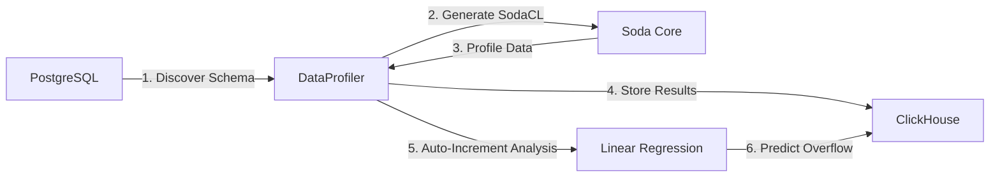

🌐 **Language:** [English](README.md) | **ภาษาไทย**

# DataProfiler

เครื่องมือสำหรับทำ **Data Profiling** อัตโนมัติจาก PostgreSQL แบบ [dbt-profiler](https://github.com/data-mie/dbt-profiler) style และจัดเก็บผลลัพธ์ลง ClickHouse


## 🎯 ภาพรวม

DataProfiler ทำหน้าที่:

1. **ดึงข้อมูล Schema** อัตโนมัติจาก PostgreSQL (information_schema)
2. **คำนวณ Metrics** แบบ dbt-profiler style ด้วย SQL queries
3. **จัดเก็บผลลัพธ์** ลง ClickHouse เพื่อการวิเคราะห์และติดตาม
4. **Export ได้หลายรูปแบบ**: Markdown, JSON, CSV, Console Table
5. **Web Dashboard** สำหรับ visualize ข้อมูล (React + TailwindCSS)
6. **วิเคราะห์ความเสี่ยง Auto-Increment Overflow** พร้อมทำนายการเติบโตด้วย Linear Regression

## 📊 ข้อมูลที่ Profile

สำหรับแต่ละ Column ระบบจะเก็บข้อมูลสถิติดังนี้ (dbt-profiler compatible):

| Metric                | คำอธิบาย                                | Condition             |
| --------------------- | --------------------------------------- | --------------------- |
| `column_name`         | ชื่อ column                             | ทุก column            |
| `data_type`           | ประเภทข้อมูล                            | ทุก column            |
| `not_null_proportion` | สัดส่วนค่าที่ไม่เป็น NULL (0.00 - 1.00) | ทุก column            |
| `distinct_proportion` | สัดส่วนค่าที่ไม่ซ้ำกัน (0.00 - 1.00)    | ทุก column            |
| `distinct_count`      | จำนวนค่าที่ไม่ซ้ำกัน                    | ทุก column            |
| `is_unique`           | เป็น unique หรือไม่ (true/false)        | ทุก column            |
| `min` / `max`         | ค่าต่ำสุด / สูงสุด                      | numeric, date, time\* |
| `avg`                 | ค่าเฉลี่ย                               | numeric\*\*           |
| `median`              | ค่ามัธยฐาน                              | numeric\*\*           |
| `std_dev_population`  | Standard deviation (population)         | numeric\*\*           |
| `std_dev_sample`      | Standard deviation (sample)             | numeric\*\*           |
| `profiled_at`         | เวลาที่ทำ profile                       | ทุก column            |

> **\*** `min`/`max` รองรับเฉพาะ: integer, numeric, float, date, timestamp, time  
> **\*\*** `avg`, `median`, `std_dev` รองรับเฉพาะ: integer, numeric, float

## 🔮 การวิเคราะห์ความเสี่ยง Auto-Increment Overflow

DataProfiler มีฟีเจอร์ **วิเคราะห์ความเสี่ยง Auto-Increment Column Overflow** เพื่อทำนายว่า Primary Key จะเต็มเมื่อใด

### ฟีเจอร์

- **ติดตามค่าปัจจุบัน**: ตรวจสอบค่าปัจจุบันของ auto-increment columns
- **คำนวณค่าสูงสุด**: คำนวณค่า max ตาม data type (เช่น INT, BIGINT)
- **เปอร์เซ็นต์การใช้งาน**: คำนวณ capacity ที่ใช้ไปแล้ว
- **ทำนายอัตราการเติบโต**: ใช้ Linear Regression กับข้อมูลย้อนหลังจาก ClickHouse
- **จำนวนวันก่อนเต็ม**: ทำนายว่าอีกกี่วัน column จะถึงค่าสูงสุด
- **สถานะแจ้งเตือน**: CRITICAL (< 30 วัน / > 90%), WARNING (< 90 วัน / > 75%), NORMAL

### Data Types ที่รองรับ

| Data Type   | ค่าสูงสุด                 | ช่วง                                   |
| ----------- | ------------------------- | -------------------------------------- |
| `smallint`  | 32,767                    | -32,768 ถึง 32,767                     |
| `integer`   | 2,147,483,647             | -2.1 พันล้าน ถึง 2.1 พันล้าน           |
| `bigint`    | 9,223,372,036,854,775,807 | -9.2 ควินทิลเลียน ถึง 9.2 ควินทิลเลียน |
| `serial`    | 2,147,483,647             | 1 ถึง 2.1 พันล้าน                      |
| `bigserial` | 9,223,372,036,854,775,807 | 1 ถึง 9.2 ควินทิลเลียน                 |

> **หมายเหตุ**: รองรับ PostgreSQL ทุกเวอร์ชัน (10+) โดย query ค่า sequence โดยตรงจาก sequence object เพื่อความน่าเชื่อถือสูงสุด

### การใช้งาน

```bash
# รวมการวิเคราะห์ auto-increment
python main.py users --auto-increment

# กำหนดระยะเวลาย้อนหลัง (ค่าเริ่มต้น: 7 วัน)
python main.py users --auto-increment --lookback-days 14

# พร้อมระบุ application และ environment
python main.py users --app order-service --env production --auto-increment
```

### ตัวอย่าง Output

```
============================================================
AUTO-INCREMENT OVERFLOW RISK ANALYSIS
============================================================

🟢 users.id (integer)
   Current: 1,234,567 / 2,147,483,647
   Usage: 0.057479%
   Days until full: 4,521 days
   Growth rate: ~500 IDs/day
============================================================
```

## 🛠️ Requirements

- Python 3.10+
- PostgreSQL
- ClickHouse
- Dependencies:
  - `psycopg2` - PostgreSQL adapter
  - `clickhouse-connect` - ClickHouse client
  - `soda-core-postgres` - Soda Core for PostgreSQL
  - `jinja2` - Template engine
  - `python-dotenv` - Environment variable management
  - `numpy` - Numerical computing
  - `scipy` - Scientific computing (Linear Regression)

## 📦 Installation

1. Clone repository:

```bash
git clone <repository-url>
cd DataProfiler
```

2. สร้าง Virtual Environment และ Activate:

```bash
# สร้าง venv
python -m venv venv

# Activate (macOS/Linux)
source venv/bin/activate

# Activate (Windows)
venv\Scripts\activate
```

3. ติดตั้ง Dependencies จาก requirements.txt:

```bash
pip install -r requirements.txt
```

> **หมายเหตุ:** หากต้องการอัปเดต dependencies ให้รัน `pip install -r requirements.txt --upgrade`

## ⚙️ Configuration

### 1. สร้างไฟล์ Environment Variables

คัดลอก `.env.example` เป็น `.env` และแก้ไขค่าตามจริง:

```bash
cp .env.example .env
```

แก้ไขไฟล์ `.env`:

```bash
# PostgreSQL Configuration
POSTGRES_HOST=localhost
POSTGRES_PORT=5432
POSTGRES_DATABASE=postgres
POSTGRES_USER=postgres
POSTGRES_PASSWORD=your_actual_password
POSTGRES_SCHEMA=public

# ClickHouse Configuration
CLICKHOUSE_HOST=localhost
CLICKHOUSE_PORT=8123
CLICKHOUSE_USER=default
CLICKHOUSE_PASSWORD=your_actual_password
```

> ⚠️ **สำคัญ:** ไฟล์ `.env` ถูก ignore โดย git อยู่แล้ว ไม่ต้องกังวลเรื่อง commit credentials

### 2. Soda Core Configuration

แก้ไขไฟล์ `configuration.yml` สำหรับ Soda Core:

```yaml
data_source my_postgres:
  type: postgres
  host: ${POSTGRES_HOST}
  port: ${POSTGRES_PORT}
  username: ${POSTGRES_USER}
  password: ${POSTGRES_PASSWORD}
  database: ${POSTGRES_DATABASE}
  schema: ${POSTGRES_SCHEMA}
```

## 🚀 Usage

### Basic Usage

```bash
# Profile 'users' table (default app/env)
python main.py users

# Profile with Application & Environment context
python main.py users --app order-service --env uat
python main.py users --app order-service --env production

# Profile a specific table
python main.py products
```

### Output Formats

```bash
# Console table (default)
python main.py users --format table

# Markdown (dbt-profiler style)
python main.py users --format markdown

# JSON
python main.py users --format json

# CSV
python main.py users --format csv
```

### Save to File

```bash
python main.py users --format markdown --output profiles/users.md
python main.py users --format json --output profiles/users.json
python main.py users --format csv --output profiles/users.csv
```

### Additional Options

```bash
# Skip storing to ClickHouse
python main.py users --no-store

# Verbose logging
python main.py users -v

# รวมการวิเคราะห์ auto-increment overflow
python main.py users --auto-increment

# กำหนดระยะเวลาย้อนหลังสำหรับการคำนวณ growth rate
python main.py users --auto-increment --lookback-days 14

# Show help
python main.py --help
```

## 📁 Project Structure

```
DataProfiler/
├── .env.example           # Environment variables template
├── .env                   # Environment variables (git ignored)
├── .gitignore             # Git ignore rules
├── configuration.yml      # Soda Core data source configuration
├── docker-compose.yml     # Docker test environment
├── main.py                # Main entry point
├── init-scripts/          # PostgreSQL init scripts
│   └── 01-sample-data.sql
├── pytest.ini             # Pytest configuration
├── README.md              # Documentation (English)
├── README.th.md           # Documentation (Thai)
├── requirements.txt       # Python dependencies
├── src/                   # Source code modules
│   ├── __init__.py
│   ├── config.py          # Configuration management
│   ├── exceptions.py      # Custom exceptions
│   ├── core/              # Core profiling logic
│   │   ├── __init__.py
│   │   ├── autoincrement_metrics.py  # Auto-increment analysis
│   │   ├── formatters.py  # Output formatters (MD, JSON, CSV)
│   │   ├── metrics.py     # dbt-profiler style metrics
│   │   └── profiler.py    # Legacy Soda Core profiler
│   └── db/                # Database connections
│       ├── __init__.py
│       ├── autoincrement.py  # Auto-increment detector
│       ├── clickhouse.py
│       └── postgres.py
├── tests/                 # Unit tests
│   ├── __init__.py
│   ├── test_autoincrement.py
│   ├── test_config.py
│   ├── test_connections.py
│   ├── test_metadata.py
│   └── test_profiler.py
└── venv/                  # Python virtual environment (git ignored)
```

## 🧪 Testing

### Run All Tests

```bash
# Activate virtual environment
source venv/bin/activate

# Run tests
pytest

# Run with verbose output
pytest -v

# Run with coverage report
pytest --cov=src --cov-report=term-missing
```

## 🔄 Workflow



1. **Schema Discovery** - ดึงข้อมูล Column และ Data Type จาก `information_schema`
2. **Template Generation** - สร้าง SodaCL YAML แบบ Dynamic ด้วย Jinja2
3. **Data Profiling** - Soda Core สแกนและเก็บสถิติ
4. **Result Storage** - บันทึกผลลัพธ์ลง ClickHouse table `data_profiles`
5. **Auto-Increment Analysis** - วิเคราะห์ auto-increment columns ด้วย Linear Regression
6. **Overflow Prediction** - ทำนายและบันทึกความเสี่ยงลง `autoincrement_profiles`

## 🐳 Docker Full Stack Environment

โปรเจกต์นี้รองรับการทำงานแบบ Full Stack Containerized สามารถรันระบบทั้งหมด (DBs, Backend, Frontend, Grafana) ได้ด้วยคำสั่งเดียว:

```bash
# Start all services
docker-compose up -d --build
```

### ภาพรวม Services

| Service        | URL / Port            | รายละเอียด                           |
| -------------- | --------------------- | ------------------------------------ |
| **Frontend**   | http://localhost:8080 | Main Data Profiler Dashboard (React) |
| **Grafana**    | http://localhost:3000 | Advanced Visualization (Admin)       |
| **Backend**    | Internal (5001)       | API Service (Flask)                  |
| **ClickHouse** | localhost:8123        | HTTP Interface                       |
| **PostgreSQL** | localhost:5432        | Source Database                      |

### ข้อมูลการเข้าใช้งาน (Credentials)

- **Grafana**: User: `admin`, Pass: `admin` (หรือตั้งค่าผ่าน `GRAFANA_ADMIN_PASSWORD` ใน .env)
- **Databases**: User: `default`/`postgres`, Pass: `password123`

### ข้อมูลตัวอย่าง & การทดสอบ

Docker จะสร้างข้อมูลตัวอย่าง **100+ records** ใน PostgreSQL ให้อัตโนมัติ (ตาราง `users` และ `products`) สามารถสั่งรัน Profiler ผ่าน Docker ได้เลย:

```bash
# รัน profiler ภายใน backend container
docker-compose exec backend python ../main.py users --app order-service --env production

# รันพร้อม auto-increment analysis
docker-compose exec backend python ../main.py users --auto-increment
```

### การหยุดการทำงาน

```bash
docker-compose down -v  # หยุดและลบ volumes
```

## 📋 ClickHouse Schema

### ตาราง `data_profiles`

ตารางหลักสำหรับเก็บผลลัพธ์การ profiling:

```sql
CREATE TABLE data_profiles (
    scan_time DateTime DEFAULT now(),
    table_name String,
    column_name String,
    distinct_count Nullable(Int64),
    missing_count Nullable(Int64),
    min Nullable(String),
    max Nullable(String),
    avg Nullable(Float64)
) ENGINE = MergeTree() ORDER BY (scan_time, table_name)
```

### ตาราง `autoincrement_profiles`

ตารางสำหรับเก็บผลการวิเคราะห์ auto-increment overflow:

```sql
CREATE TABLE autoincrement_profiles (
    profiled_at DateTime DEFAULT now(),
    application String,
    environment String,
    table_name String,
    column_name String,
    data_type String,
    current_value Int64,
    max_type_value Int64,
    usage_percentage Float64,
    daily_growth_rate Nullable(Float64),
    days_until_full Nullable(Float64),
    alert_status String
) ENGINE = MergeTree() ORDER BY (profiled_at, table_name, column_name)
```

## 📊 การพัฒนา Dashboard

หากต้องการรัน Dashboard แบบ Manual (ไม่อยู่ใน Docker) เพื่อการพัฒนา:

```bash
# 1. Start Backend API
cd dashboard/backend
python app.py

# 2. Start Frontend
cd dashboard/frontend
npm run dev
# เข้าใช้งานที่ http://localhost:5173
```

### Technology Stack

| Component | Technology         |
| --------- | ------------------ |
| Backend   | Flask + Flask-CORS |
| Frontend  | React + Vite       |
| Styling   | TailwindCSS        |
| Charts    | Recharts           |

## 📈 Grafana Dashboard (ทางเลือกเสริม)

โปรเจกต์นี้มาพร้อมกับ **Grafana** ที่เชื่อมต่อกับ ClickHouse ให้โดยอัตโนมัติ


### ฟีเจอร์

- **Direct ClickHouse Integration**: เชื่อมต่อโดยตรง ไม่ต้องผ่าน middleware
- **Customizable**: สร้าง Dashboard ที่ซับซ้อนด้วย SQL
- **Alerting**: รองรับระบบแจ้งเตือนของ Grafana
- **User Management**: ระบบจัดการผู้ใช้งาน

### การใช้งาน

Grafana ถูกรวมอยู่ใน `docker-compose.yml` แล้ว:

1. Start services:

   ```bash
   docker-compose up -d
   ```

2. เข้าใช้งาน Grafana:

   - URL: http://localhost:3000
   - User: `admin`
   - Password: `admin`

3. สร้าง Dashboard:
   - DataSource: **ClickHouse** (ถูกตั้งค่าไว้แล้ว)
   - Example Query (Data Profiles):
     ```sql
     SELECT table_name, max(row_count) as rows
     FROM data_profiles
     GROUP BY table_name
     ```
   - Example Query (Auto-Increment Monitoring):
     ```sql
     SELECT
       table_name,
       column_name,
       usage_percentage,
       days_until_full,
       alert_status
     FROM autoincrement_profiles
     ORDER BY profiled_at DESC
     LIMIT 100
     ```

## ⚠️ Limitations

Data Types ที่ไม่รองรับในปัจจุบัน (สำหรับ min/max/avg):

- `timestamp`
- `timestamp without time zone`
- `date`
- `bytea`

## 📝 License

[MIT License](LICENSE)

## 🤝 Contributing

Pull requests ยินดีต้อนรับ! สำหรับการเปลี่ยนแปลงใหญ่ กรุณาเปิด Issue ก่อนเพื่อหารือ
