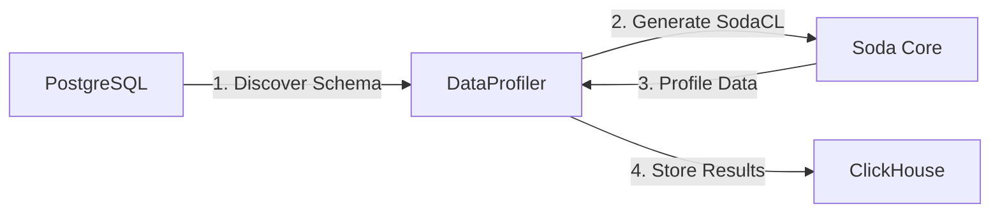

🌐 **Language:** [English](README.md) | **ภาษาไทย**

# DataProfiler

เครื่องมือสำหรับทำ **Data Profiling** อัตโนมัติจาก PostgreSQL แบบ [dbt-profiler](https://github.com/data-mie/dbt-profiler) style และจัดเก็บผลลัพธ์ลง ClickHouse


## 🎯 ภาพรวม

DataProfiler ทำหน้าที่:

1. **ดึงข้อมูล Schema** อัตโนมัติจาก PostgreSQL (information_schema)
2. **คำนวณ Metrics** แบบ dbt-profiler style ด้วย SQL queries
3. **จัดเก็บผลลัพธ์** ลง ClickHouse เพื่อการวิเคราะห์และติดตาม
4. **Export ได้หลายรูปแบบ**: Markdown, JSON, CSV, Console Table
5. **Web Dashboard** สำหรับ visualize ข้อมูล (React + TailwindCSS)

## 📊 ข้อมูลที่ Profile

สำหรับแต่ละ Column ระบบจะเก็บข้อมูลสถิติดังนี้ (dbt-profiler compatible):

| Metric                | คำอธิบาย                                | Condition             |
| --------------------- | --------------------------------------- | --------------------- |
| `column_name`         | ชื่อ column                             | ทุก column            |
| `data_type`           | ประเภทข้อมูล                            | ทุก column            |
| `not_null_proportion` | สัดส่วนค่าที่ไม่เป็น NULL (0.00 - 1.00) | ทุก column            |
| `distinct_proportion` | สัดส่วนค่าที่ไม่ซ้ำกัน (0.00 - 1.00)    | ทุก column            |
| `distinct_count`      | จำนวนค่าที่ไม่ซ้ำกัน                    | ทุก column            |
| `is_unique`           | เป็น unique หรือไม่ (true/false)        | ทุก column            |
| `min` / `max`         | ค่าต่ำสุด / สูงสุด                      | numeric, date, time\* |
| `avg`                 | ค่าเฉลี่ย                               | numeric\*\*           |
| `median`              | ค่ามัธยฐาน                              | numeric\*\*           |
| `std_dev_population`  | Standard deviation (population)         | numeric\*\*           |
| `std_dev_sample`      | Standard deviation (sample)             | numeric\*\*           |
| `profiled_at`         | เวลาที่ทำ profile                       | ทุก column            |

> **\*** `min`/`max` รองรับเฉพาะ: integer, numeric, float, date, timestamp, time  
> **\*\*** `avg`, `median`, `std_dev` รองรับเฉพาะ: integer, numeric, float

## 🛠️ Requirements

- Python 3.10+
- PostgreSQL
- ClickHouse
- Dependencies:
  - `psycopg2` - PostgreSQL adapter
  - `clickhouse-connect` - ClickHouse client
  - `soda-core-postgres` - Soda Core for PostgreSQL
  - `jinja2` - Template engine
  - `python-dotenv` - Environment variable management

## 📦 Installation

1. Clone repository:

```bash
git clone <repository-url>
cd DataProfiler
```

2. สร้าง Virtual Environment และ Activate:

```bash
# สร้าง venv
python -m venv venv

# Activate (macOS/Linux)
source venv/bin/activate

# Activate (Windows)
venv\Scripts\activate
```

3. ติดตั้ง Dependencies จาก requirements.txt:

```bash
pip install -r requirements.txt
```

> **หมายเหตุ:** หากต้องการอัปเดต dependencies ให้รัน `pip install -r requirements.txt --upgrade`

## ⚙️ Configuration

### 1. สร้างไฟล์ Environment Variables

คัดลอก `.env.example` เป็น `.env` และแก้ไขค่าตามจริง:

```bash
cp .env.example .env
```

แก้ไขไฟล์ `.env`:

```bash
# PostgreSQL Configuration
POSTGRES_HOST=localhost
POSTGRES_PORT=5432
POSTGRES_DATABASE=postgres
POSTGRES_USER=postgres
POSTGRES_PASSWORD=your_actual_password
POSTGRES_SCHEMA=public

# ClickHouse Configuration
CLICKHOUSE_HOST=localhost
CLICKHOUSE_PORT=8123
CLICKHOUSE_USER=default
CLICKHOUSE_PASSWORD=your_actual_password
```

> ⚠️ **สำคัญ:** ไฟล์ `.env` ถูก ignore โดย git อยู่แล้ว ไม่ต้องกังวลเรื่อง commit credentials

### 2. Soda Core Configuration

แก้ไขไฟล์ `configuration.yml` สำหรับ Soda Core:

```yaml
data_source my_postgres:
  type: postgres
  host: ${POSTGRES_HOST}
  port: ${POSTGRES_PORT}
  username: ${POSTGRES_USER}
  password: ${POSTGRES_PASSWORD}
  database: ${POSTGRES_DATABASE}
  schema: ${POSTGRES_SCHEMA}
```

## 🚀 Usage

### Basic Usage

```bash
# Profile 'users' table (default)
python main.py

# Profile a specific table
python main.py products
```

### Output Formats

```bash
# Console table (default)
python main.py users --format table

# Markdown (dbt-profiler style)
python main.py users --format markdown

# JSON
python main.py users --format json

# CSV
python main.py users --format csv
```

### Save to File

```bash
python main.py users --format markdown --output profiles/users.md
python main.py users --format json --output profiles/users.json
python main.py users --format csv --output profiles/users.csv
```

### Additional Options

```bash
# Skip storing to ClickHouse
python main.py users --no-store

# Verbose logging
python main.py users -v

# Show help
python main.py --help
```

## 📁 Project Structure

```
DataProfiler/
├── .env.example           # Environment variables template
├── .env                   # Environment variables (git ignored)
├── .gitignore             # Git ignore rules
├── configuration.yml      # Soda Core data source configuration
├── docker-compose.yml     # Docker test environment
├── main.py                # Main entry point
├── init-scripts/          # PostgreSQL init scripts
│   └── 01-sample-data.sql
├── pytest.ini             # Pytest configuration
├── README.md              # Documentation
├── requirements.txt       # Python dependencies
├── src/                   # Source code modules
│   ├── __init__.py
│   ├── config.py          # Configuration management
│   ├── exceptions.py      # Custom exceptions
│   ├── core/              # Core profiling logic
│   │   ├── __init__.py
│   │   ├── formatters.py  # Output formatters (MD, JSON, CSV)
│   │   ├── metrics.py     # dbt-profiler style metrics
│   │   └── profiler.py    # Legacy Soda Core profiler
│   └── db/                # Database connections
│       ├── __init__.py
│       ├── clickhouse.py
│       └── postgres.py
├── tests/                 # Unit tests (37 tests)
│   ├── __init__.py
│   ├── test_config.py
│   ├── test_connections.py
│   ├── test_metadata.py
│   └── test_profiler.py
└── venv/                  # Python virtual environment (git ignored)
```

## 🧪 Testing

### Run All Tests

```bash
# Activate virtual environment
source venv/bin/activate

# Run tests
pytest

# Run with verbose output
pytest -v

# Run with coverage report
pytest --cov=src --cov-report=term-missing
```

### Test Coverage

Current coverage: **37 tests** across 4 test modules

## 🔄 Workflow



1. **Schema Discovery** - ดึงข้อมูล Column และ Data Type จาก `information_schema`
2. **Template Generation** - สร้าง SodaCL YAML แบบ Dynamic ด้วย Jinja2
3. **Data Profiling** - Soda Core สแกนและเก็บสถิติ
4. **Result Storage** - บันทึกผลลัพธ์ลง ClickHouse table `data_profiles`

## 🐳 Docker Development Environment

สำหรับการทดสอบ สามารถใช้ Docker Compose เพื่อสร้าง PostgreSQL และ ClickHouse:

### เริ่มต้น Services

```bash
# Start ทุก services
docker-compose up -d

# ดู logs
docker-compose logs -f

# ตรวจสอบสถานะ
docker-compose ps
```

### Sample Data

Docker จะสร้างข้อมูลตัวอย่างโดยอัตโนมัติ:

| ตาราง      | รายละเอียด                                             |
| ---------- | ------------------------------------------------------ |
| `users`    | 10 records - ข้อมูลผู้ใช้ (มี NULL values สำหรับทดสอบ) |
| `products` | 8 records - ข้อมูลสินค้า                               |

### ทดสอบ DataProfiler

```bash
# Profile ตาราง users
python main.py users

# Profile ตาราง products
python main.py products
```

### หยุด Services

```bash
# Stop ทุก services
docker-compose down

# Stop และลบข้อมูลทั้งหมด
docker-compose down -v
```

## 📋 ClickHouse Schema

ตาราง `data_profiles` ที่ระบบสร้างอัตโนมัติ:

```sql
CREATE TABLE data_profiles (
    scan_time DateTime DEFAULT now(),
    table_name String,
    column_name String,
    distinct_count Nullable(Int64),
    missing_count Nullable(Int64),
    min Nullable(String),
    max Nullable(String),
    avg Nullable(Float64)
) ENGINE = MergeTree() ORDER BY (scan_time, table_name)
```

## 📊 Dashboard

DataProfiler มาพร้อม Web Dashboard สำหรับ visualize ข้อมูล profile

### Features

- **Sidebar Navigation** - รายการตารางพร้อมจำนวน rows/columns
- **Bar Charts** - Not Null Proportion, Distinct Proportion
- **Column Details Table** - แสดงทุก metrics ในรูปแบบตาราง
- **Dark Theme** - Modern UI

### การใช้งาน Dashboard

```bash
# 1. Start Backend API (port 5001)
cd dashboard/backend
source ../venv/bin/activate
python app.py

# 2. Start Frontend (port 5173)
cd dashboard/frontend
npm install  # ครั้งแรกเท่านั้น
npm run dev

# 3. เปิด Browser
open http://localhost:5173
```

### Technology Stack

| Component | Technology         |
| --------- | ------------------ |
| Backend   | Flask + Flask-CORS |
| Frontend  | React + Vite       |
| Styling   | TailwindCSS        |
| Charts    | Recharts           |

## ⚠️ Limitations

Data Types ที่ไม่รองรับในปัจจุบัน:

- `timestamp`
- `timestamp without time zone`
- `date`
- `bytea`

## 📝 License

[MIT License](LICENSE)

## 🤝 Contributing

Pull requests ยินดีต้อนรับ! สำหรับการเปลี่ยนแปลงใหญ่ กรุณาเปิด Issue ก่อนเพื่อหารือ
