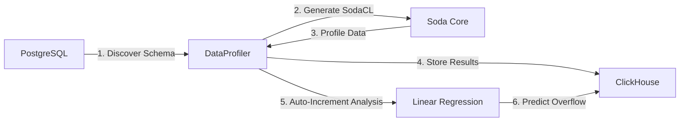
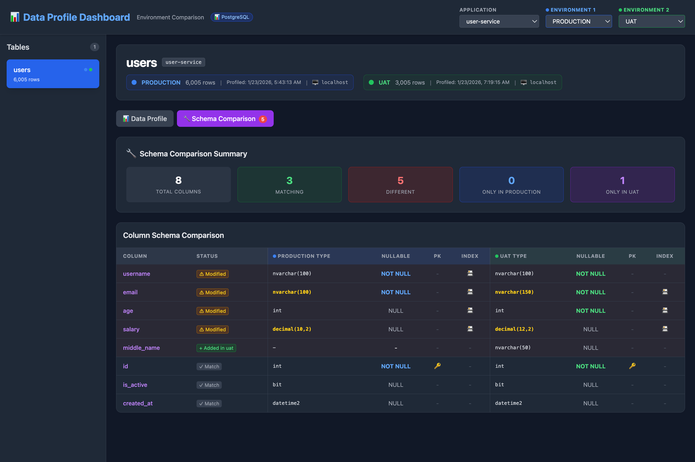
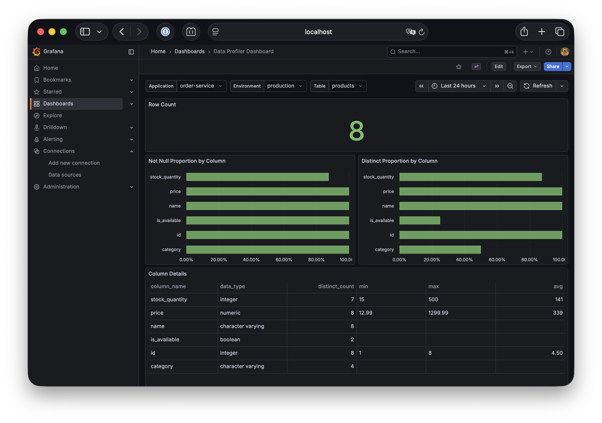

🌐 **Language:** [English](README.md) | **ภาษาไทย**

# DataProfiler

เครื่องมือสำหรับทำ **Data Profiling** อัตโนมัติจาก **PostgreSQL** และ **Microsoft SQL Server** แบบ [dbt-profiler](https://github.com/data-mie/dbt-profiler) style และจัดเก็บผลลัพธ์ลง ClickHouse


## 🎯 ภาพรวม

DataProfiler ทำหน้าที่:

1. **รองรับหลาย Database**: PostgreSQL, Microsoft SQL Server (Azure SQL Edge) และ **MySQL**
2. **เก็บ Table Inventory อัตโนมัติ**: ค้นหาและบันทึก table ทั้งหมดในแต่ละ schema สำหรับตรวจจับ drift
3. **ค้นหา Schema อัตโนมัติ** จาก source databases (information_schema)
4. **คำนวณ Metrics แบบ dbt-profiler** ผ่าน SQL queries (เปิดใช้ด้วย `--data-profile`)
5. **เก็บผลลัพธ์ได้ยืดหยุ่น**: เลือกระหว่าง ClickHouse หรือ PostgreSQL
6. **Export หลายรูปแบบ**: Markdown, JSON, CSV, Console Table
7. **Web Dashboard** สำหรับ data visualization (React + TailwindCSS)
8. **Auto-Increment Overflow Risk Analysis**: วิเคราะห์ความเสี่ยงและทำนายการเติบโตด้วย Linear Regression
9. **Schema Objects Profiling**: เก็บ Metadata ของ Stored Procedures, Views, และ Triggers เพื่อเฝ้าระวังการเปลี่ยนแปลง
10. **Schema Comparison**: เปรียบเทียบโครงสร้าง Table และ Database Objects ระหว่าง Environment (เช่น UAT เทียบ Prod)
11. **Control-M Integration**: พร้อมใช้งานกับ Enterprise Job Scheduler ด้วย Wrapper Script
12. **Full Stack Docker**: สภาพแวดล้อมพร้อมใช้ (Grafana, ClickHouse, Postgres Metrics)
13. **High Performance**: ใช้ Catalog Statistics (O(1)) ในการนับจำนวนแถวแทนการ scan ทั้ง table

## 📊 ข้อมูลที่ Profile

สำหรับแต่ละ Column ระบบจะเก็บข้อมูลสถิติดังนี้ (dbt-profiler compatible):

| Metric                | คำอธิบาย                                | Condition             |
| --------------------- | --------------------------------------- | --------------------- |
| `column_name`         | ชื่อ column                             | ทุก column            |
| `data_type`           | ประเภทข้อมูล                            | ทุก column            |
| `not_null_proportion` | สัดส่วนค่าที่ไม่เป็น NULL (0.00 - 1.00) | ทุก column            |
| `distinct_proportion` | สัดส่วนค่าที่ไม่ซ้ำกัน (0.00 - 1.00)    | ทุก column            |
| `distinct_count`      | จำนวนค่าที่ไม่ซ้ำกัน                    | ทุก column            |
| `is_unique`           | เป็น unique หรือไม่ (true/false)        | ทุก column            |
| `min` / `max`         | ค่าต่ำสุด / สูงสุด                      | numeric, date, time\* |
| `avg`                 | ค่าเฉลี่ย                               | numeric\*\*           |
| `median`              | ค่ามัธยฐาน                              | numeric\*\*           |
| `std_dev_population`  | Standard deviation (population)         | numeric\*\*           |
| `std_dev_sample`      | Standard deviation (sample)             | numeric\*\*           |
| `profiled_at`         | เวลาที่ทำ profile                       | ทุก column            |

> **\*** `min`/`max` รองรับเฉพาะ: integer, numeric, float, date, timestamp, time  
> **\*\*** `avg`, `median`, `std_dev` รองรับเฉพาะ: integer, numeric, float

## 🔮 การวิเคราะห์ความเสี่ยง Auto-Increment Overflow

DataProfiler มีฟีเจอร์ **วิเคราะห์ความเสี่ยง Auto-Increment Column Overflow** เพื่อทำนายว่า Primary Key จะเต็มเมื่อใด

### ฟีเจอร์

- **ติดตามค่าปัจจุบัน**: ตรวจสอบค่าปัจจุบันของ auto-increment columns
- **คำนวณค่าสูงสุด**: คำนวณค่า max ตาม data type (เช่น INT, BIGINT)
- **เปอร์เซ็นต์การใช้งาน**: คำนวณ capacity ที่ใช้ไปแล้ว
- **ทำนายอัตราการเติบโต**: ใช้ Linear Regression กับข้อมูลย้อนหลังจาก ClickHouse
- **จำนวนวันก่อนเต็ม**: ทำนายว่าอีกกี่วัน column จะถึงค่าสูงสุด
- **สถานะแจ้งเตือน**: CRITICAL (< 30 วัน / > 90%), WARNING (< 90 วัน / > 75%), NORMAL

### Data Types ที่รองรับ

| Data Type   | ค่าสูงสุด                 | ช่วง                                   |
| ----------- | ------------------------- | -------------------------------------- |
| `smallint`  | 32,767                    | -32,768 ถึง 32,767                     |
| `integer`   | 2,147,483,647             | -2.1 พันล้าน ถึง 2.1 พันล้าน           |
| `bigint`    | 9,223,372,036,854,775,807 | -9.2 ควินทิลเลียน ถึง 9.2 ควินทิลเลียน |
| `serial`    | 2,147,483,647             | 1 ถึง 2.1 พันล้าน                      |
| `bigserial` | 9,223,372,036,854,775,807 | 1 ถึง 9.2 ควินทิลเลียน                 |

#### MSSQL Data Types

| Data Type  | ค่าสูงสุด                 | ช่วง                                   |
| ---------- | ------------------------- | -------------------------------------- |
| `tinyint`  | 255                       | 0 ถึง 255                              |
| `smallint` | 32,767                    | -32,768 ถึง 32,767                     |
| `int`      | 2,147,483,647             | -2.1 พันล้าน ถึง 2.1 พันล้าน           |
| `bigint`   | 9,223,372,036,854,775,807 | -9.2 ควินทิลเลียน ถึง 9.2 ควินทิลเลียน |

> **หมายเหตุ**: รองรับทั้ง PostgreSQL SERIAL/BIGSERIAL/IDENTITY columns และ MSSQL IDENTITY columns

## 🏗️ Schema Profiling & Comparison

DataProfiler สามารถทำ Profile ข้อมูล Schema (Columns, Data Types, Indexes, Foreign Keys) และจัดเก็บเพื่อเปรียบเทียบระหว่าง Environment ที่แตกต่างกัน (เช่น UAT เทียบกับ Production)

### ฟีเจอร์

- **Schema Snapshot**: เก็บข้อมูล Metadata ของ Schema อย่างละเอียด
- **Comparison Dashboard**: เปรียบเทียบความแตกต่างผ่าน Grafana Dashboard
- **Multi-Database Support**: รองรับการ Profile Schema จากทั้ง PostgreSQL และ MSSQL
- **Strict Mode**: เปรียบเทียบค่า Default, Nullability และ Index Structure อย่างละเอียด

### ข้อมูลที่เปรียบเทียบ

| หมวดหมู่        | ตรวจสอบ                                            |
| --------------- | -------------------------------------------------- |
| **Columns**     | การมีอยู่, Data Types, Nullability, Default Values |
| **Indexes**     | Primary Keys, Index Membership, ชื่อ Index         |
| **Columns**     | การมีอยู่, Data Types, Nullability, Default Values |
| **Indexes**     | Primary Keys, Index Membership, ชื่อ Index         |
| **Constraints** | Foreign Keys, Check Constraints                    |

### Schema Objects Profiling

นอกเหนือจาก Table Schemas แล้ว DataProfiler ยังเก็บ Metadata ของ Database Objects อื่นๆ อัตโนมัติ:

- **Stored Procedures**
- **Views**
- **Triggers**

ช่วยให้ตรวจจับการเพิ่ม, ลบ, หรือเปลี่ยนแปลง Objects ระหว่าง Environment ได้

> **หมายเหตุ:** Schema object profiling จะทำงานอัตโนมัติเมื่อเปิดใช้งาน Metrics Storage (ค่าเริ่มต้น) โดยไม่ต้องระบุ `--profile-schema`

### การใช้งาน

```bash
# PostgreSQL (ค่าเริ่มต้น)
python main.py --table users --auto-increment

# MSSQL
python main.py --table users -d mssql --auto-increment

# กำหนดระยะเวลาย้อนหลัง (ค่าเริ่มต้น: 7 วัน)
python main.py --table users --auto-increment --lookback-days 14

# พร้อมระบุ application และ environment
python main.py --table users --app order-service --env production --auto-increment
```

### Schema Profiling

```bash
# Profile schema สำหรับ User Service ที่ Production
python main.py --table users --profile-schema --app user-service --env production

# Profile table เดียวกันที่ UAT
python main.py --table users --profile-schema --app user-service --env uat

# Profile หลาย tables พร้อมกัน
python main.py -t users,orders --profile-schema --app user-service --env production

# ดูผลการเปรียบเทียบผ่าน Grafana Dashboard (Table Schema Comparison)
```

### Schema Objects Comparison

Schema objects (Stored Procedures, Views, Triggers) จะถูก Profile อัตโนมัติเมื่อเชื่อมต่อ Database พร้อม Metrics Storage

```bash
# Profile schema objects (และ table inventory)
python main.py --app user-service --env production --schema prod
```

ดูผลลัพธ์ได้ที่ **Schema Objects Comparison Dashboard**
```

### ตัวอย่าง Output

```
============================================================
AUTO-INCREMENT OVERFLOW RISK ANALYSIS
============================================================

🟢 users.id (integer)
   Current: 1,234,567 / 2,147,483,647
   Usage: 0.057479%
   Days until full: 4,521 days
   Growth rate: ~500 IDs/day
============================================================
```

## 🛠️ Requirements

- Python 3.10+
- PostgreSQL และ/หรือ Microsoft SQL Server (Azure SQL Edge สำหรับ ARM64/M1)
- MySQL (v8.0+)
- ClickHouse
- Dependencies:
  - `psycopg2` - PostgreSQL adapter
  - `pymssql` - MSSQL adapter
  - `clickhouse-connect` - ClickHouse client
  - `mysql-connector-python` - MySQL adapter
  - `soda-core-postgres` - Soda Core for PostgreSQL
  - `soda-core-sqlserver` - Soda Core for SQL Server
  - `jinja2` - Template engine
  - `python-dotenv` - Environment variable management
  - `numpy` - Numerical computing
  - `scipy` - Scientific computing (Linear Regression)

## 📦 Installation

1. Clone repository:

```bash
git clone <repository-url>
cd DataProfiler
```

2. สร้าง Virtual Environment และ Activate:

```bash
# สร้าง venv
python -m venv venv

# Activate (macOS/Linux)
source venv/bin/activate

# Activate (Windows)
venv\Scripts\activate
```

3. ติดตั้ง Dependencies จาก requirements.txt:

```bash
pip install -r requirements.txt
```

> **หมายเหตุ:** หากต้องการอัปเดต dependencies ให้รัน `pip install -r requirements.txt --upgrade`

## ⚙️ Configuration

### 1. สร้างไฟล์ Environment Variables

คัดลอก `.env.example` เป็น `.env` และแก้ไขค่าตามจริง:

```bash
cp .env.example .env
```

แก้ไขไฟล์ `.env`:

```bash
# PostgreSQL Configuration
POSTGRES_HOST=localhost
POSTGRES_PORT=5432
POSTGRES_DATABASE=postgres
POSTGRES_USER=postgres
POSTGRES_PASSWORD=your_actual_password
POSTGRES_SCHEMA=public

# MySQL Configuration
MYSQL_HOST=localhost
MYSQL_PORT=3306
MYSQL_DATABASE=prod
MYSQL_USER=user
MYSQL_PASSWORD=password123

# ClickHouse Configuration
CLICKHOUSE_HOST=localhost
CLICKHOUSE_PORT=8123
CLICKHOUSE_USER=default
CLICKHOUSE_PASSWORD=your_actual_password

# Metrics Backend Configuration
# Options: 'postgresql' (default) or 'clickhouse'
METRICS_BACKEND=postgresql

# PostgreSQL Metrics Configuration (instance แยกสำหรับเก็บผลลัพธ์ profiling)
# เมื่อใช้ docker-compose จะชี้ไปที่ postgres-metrics service (port 5433)
PG_METRICS_HOST=localhost
PG_METRICS_PORT=5433
PG_METRICS_DATABASE=profiler_metrics
PG_METRICS_USER=postgres
PG_METRICS_PASSWORD=your_password
```

> ⚠️ **สำคัญ:** ไฟล์ `.env` ถูก ignore โดย git อยู่แล้ว ไม่ต้องกังวลเรื่อง commit credentials

### 2. Oracle Configuration (Optional)

หากใช้งาน Oracle เป็น source database หรือ metrics storage ให้เพิ่มค่าเหล่านี้ในไฟล์ `.env`:

```bash
# Oracle Configuration
ORACLE_HOST=localhost
ORACLE_PORT=1521
ORACLE_SERVICE_NAME=orcl
ORACLE_USER=system
ORACLE_PASSWORD=oracle
ORACLE_SCHEMA=public
```

### 3. Soda Core Configuration

แก้ไขไฟล์ `configuration.yml` สำหรับ Soda Core:

```yaml
data_source my_postgres:
  type: postgres
  host: ${POSTGRES_HOST}
  port: ${POSTGRES_PORT}
  username: ${POSTGRES_USER}
  password: ${POSTGRES_PASSWORD}
  database: ${POSTGRES_DATABASE}
  schema: ${POSTGRES_SCHEMA}

data_source my_mssql:
  type: sqlserver
  host: ${MSSQL_HOST}
  port: ${MSSQL_PORT}
  username: ${MSSQL_USER}
  password: ${MSSQL_PASSWORD}
  database: ${MSSQL_DATABASE}
  schema: ${MSSQL_SCHEMA}
```

## 🚀 Usage

### Basic Usage

โดยค่าเริ่มต้น (ไม่ต้องระบุ feature flags) DataProfiler จะเก็บ **table inventory** เท่านั้น — ไม่ต้องระบุ `--table`:

```bash
# เก็บ table inventory อย่างเดียว (default behavior)
python main.py -d mssql --schema prod --app order-svc --env production

# เก็บ table inventory จาก PostgreSQL (ค่าเริ่มต้น)
python main.py --app user-service --env uat --schema public
```

### Data Profiling (`--data-profile`)

ใช้ `--data-profile` เพื่อเปิด column-level statistics ต้องระบุ `--table` ด้วย:

```bash
# Profile 'users' table จาก PostgreSQL
python main.py --table users --data-profile

# Profile หลาย tables พร้อมกัน
python main.py -t users,orders,products --data-profile

# Profile จาก Schema ที่กำหนด
python main.py --table users --data-profile --schema prod

# Profile จาก MSSQL
python main.py --table users --data-profile -d mssql

# Profile จาก MySQL
python main.py --table users --data-profile -d mysql

# Profile with Application & Environment context
python main.py -t users,orders --data-profile -d mssql --app user-service --env uat --metrics-backend postgresql
```

### Output Formats

Output formats ใช้ได้เมื่อระบุ `--data-profile`:

```bash
# Console table (default)
python main.py --table users --data-profile --format table

# Markdown (dbt-profiler style)
python main.py --table users --data-profile --format markdown

# JSON
python main.py --table users --data-profile --format json

# CSV
python main.py --table users --data-profile --format csv
```

### Save to File

```bash
python main.py --table users --data-profile --format markdown --output profiles/users.md
python main.py --table users --data-profile --format json --output profiles/users.json
python main.py -t users,orders --data-profile --format csv --output profiles/report.csv
```

> **หมายเหตุ:** เมื่อ profile หลาย tables ด้วย `--output` ผลลัพธ์จะถูก **append** ลงไฟล์เดียวกัน

### Options เพิ่มเติม

```bash
# ไม่เก็บผลลัพธ์ลง Metrics Backend
python main.py --table users --no-store

# Verbose logging
python main.py --table users -v

# Debug logging (รวม SQL queries)
python main.py --table users --soda-debug

# ดู help
python main.py --help
```

### การเลือกประเภท Database (`-d`, `--database-type`)

เลือก source database ที่ต้องการ profile:

| Option       | รายละเอียด               | Environment Variables ที่ต้องการ                   |
| ------------ | ------------------------ | -------------------------------------------------- |
| `postgresql` | PostgreSQL (ค่าเริ่มต้น) | `POSTGRES_HOST`, `POSTGRES_PORT`, etc.             |
| `mssql`      | Microsoft SQL Server     | `MSSQL_HOST`, `MSSQL_PORT`, `MSSQL_DATABASE`, etc. |
| `mysql`      | MySQL                    | `MYSQL_HOST`, `MYSQL_PORT`, `MYSQL_DATABASE`, etc. |
| `oracle`     | Oracle                   | `ORACLE_HOST`, `ORACLE_PORT`, `ORACLE_SERVICE_NAME`, etc. |

```bash
# Profile จาก PostgreSQL (ค่าเริ่มต้น)
python main.py --table users --data-profile

# Profile จาก MSSQL
python main.py --table users --data-profile -d mssql
python main.py --table orders --data-profile --database-type mssql

# MSSQL พร้อมวิเคราะห์ auto-increment
python main.py --table users --data-profile -d mssql --auto-increment
```

### การเลือก Metrics Backend (`--metrics-backend`)

เลือกที่เก็บผลลัพธ์การ profiling:

| Option       | รายละเอียด               | Environment Variables ที่ต้องการ          |
| ------------ | ------------------------ | ----------------------------------------- |
| `postgresql` | PostgreSQL (ค่าเริ่มต้น) | `PG_METRICS_*` หรือใช้ค่าจาก `POSTGRES_*` |
| `clickhouse` | ClickHouse               | `CLICKHOUSE_HOST`, `CLICKHOUSE_PORT`      |

```bash
# ใช้ PostgreSQL (ค่าเริ่มต้น)
python main.py --table users

# ใช้ ClickHouse เป็นที่เก็บ metrics
python main.py --table users --metrics-backend clickhouse

# รวมกัน: Profile จาก MSSQL, เก็บใน PostgreSQL
python main.py --table orders -d mssql --metrics-backend postgresql
```

### การวิเคราะห์ Auto-Increment

ต้องใช้คู่กับ `--data-profile`:

```bash
# รวมการวิเคราะห์ auto-increment overflow
python main.py --table users --data-profile --auto-increment
python main.py --table users --data-profile -d mssql --auto-increment

# กำหนดระยะเวลาย้อนหลังสำหรับคำนวณ growth rate
python main.py --table users --data-profile --auto-increment --lookback-days 14
```

### ตัวอย่างแบบสมบูรณ์: Profile MSSQL พร้อมเก็บใน PostgreSQL

```bash
# กำหนด environment variables
export MSSQL_HOST=sqlserver.local
export MSSQL_PORT=1433
export MSSQL_DATABASE=sales_db
export MSSQL_USER=sa
export MSSQL_PASSWORD='YourStrong@Password123'
export MSSQL_SCHEMA=dbo

export PG_METRICS_HOST=metrics-db.local
export PG_METRICS_PORT=5432
export PG_METRICS_DATABASE=profiler_metrics
export PG_METRICS_USER=metrics_user
export PG_METRICS_PASSWORD='your_password'

# รัน profiler
python main.py --table orders \
  --data-profile \
  -d mssql \
  --metrics-backend postgresql \
  --app sales-service \
  --env production \
  --schema prod \
  --auto-increment
```

## 📤 การ Export Dashboards

หากต้องการ Export Grafana Dashboards เพื่อนำไป Import ใน Grafana อื่น (โดยตัดคำระบุ Backend เช่น `(PostgreSQL)` หรือ `(ClickHouse)` ออกจากชื่อ), สามารถใช้สคริปต์ดังนี้:

```bash
python scripts/export_dashboards.py
```

สคริปต์จะสร้างโฟลเดอร์ `grafana/dashboards_exported` ที่บรรจุไฟล์ JSON ที่ถูกปรับแก้แล้ว

**ฟีเจอร์หลัก:**
*   **Dynamic Data Source:** ระบุประเภท Data Source อัตโนมัติจากชื่อไฟล์ (`_ch` -> ClickHouse, `_pg` -> PostgreSQL) และตั้งเป็นค่าเริ่มต้น
*   **Import Flexibility:** เพิ่มตัวแปร `DS_PROFILER_METRICS` (Template Variable) ทำให้สามารถเลือก Data Source ปลายทางได้ตอน Import

## 📁 Project Structure

```
DataProfiler/
├── .env.example           # Environment variables template
├── .env                   # Environment variables (git ignored)
├── .gitignore             # Git ignore rules
├── configuration.yml      # Soda Core data source configuration
├── docker-compose.yml     # Docker test environment
├── main.py                # Main entry point
├── init-scripts/             # Database initialization scripts
│   ├── clickhouse/           # ClickHouse schema & test data
│   ├── mssql/                # MSSQL init & data generation
│   └── postgres/             # PostgreSQL init & data generation
├── pytest.ini             # Pytest configuration
├── README.md              # Documentation (English)
├── README.th.md           # Documentation (Thai)
├── requirements.txt       # Python dependencies
├── src/                   # Source code modules
│   ├── __init__.py
│   ├── config.py          # Configuration management
│   ├── exceptions.py      # Custom exceptions
│   ├── core/              # Core profiling logic
│   │   ├── __init__.py
│   │   ├── autoincrement_metrics.py  # Auto-increment analysis
│   │   ├── formatters.py  # Output formatters (MD, JSON, CSV)
│   │   ├── metrics.py     # dbt-profiler style metrics
│   │   └── profiler.py    # Legacy Soda Core profiler
│   └── db/                # Database connections
│       ├── __init__.py
│       ├── autoincrement.py  # Auto-increment detector (PostgreSQL & MSSQL)
│       ├── clickhouse.py
│       ├── connection_factory.py  # Multi-database factory
│       ├── mssql.py        # MSSQL client
│       └── postgres.py
├── tests/                 # Unit tests
│   ├── __init__.py
│   ├── test_autoincrement.py
│   ├── test_config.py
│   ├── test_connections.py
│   ├── test_metadata.py
│   ├── test_profiler.py
│   └── test_table_inventory.py
└── venv/                  # Python virtual environment (git ignored)
```

## 🧪 Testing

### Run All Tests

```bash
# Activate virtual environment
source venv/bin/activate

# Run tests
pytest

# Run with verbose output
pytest -v

# Run with coverage report
pytest --cov=src --cov-report=term-missing
```

## 🔍 การทดสอบแบบ End-to-End (Manual Testing)

กระบวนการทดสอบเพื่อยืนยันการทำงานของระบบทั้งหมด (MSSQL, PostgreSQL):

### 1. ตั้งค่า Environment

```bash
# กำหนดค่า MSSQL Connection
export MSSQL_HOST=localhost
export MSSQL_PORT=1433
export MSSQL_DATABASE=testdb
export MSSQL_USER=sa
export MSSQL_PASSWORD=YourStrong@Password123
export MSSQL_SCHEMA=dbo

# Initialize MSSQL Database
python init-scripts/mssql/init-mssql.py
```

### 2. สร้างข้อมูลจำลอง (Seed Data)

```bash
# สร้างข้อมูลจำลองสำหรับ UAT และ Prod schemas
python init-scripts/mssql/generate-mssql-data.py --schema uat
python init-scripts/mssql/generate-mssql-data.py --schema prod
```

### 3. รัน Profiler (Full Cycle)

สามารถรันผ่าน `main.py` โดยตรง:

```bash
# Profile MSSQL (UAT) -> เก็บใน PostgreSQL
python main.py -t users,products -d mssql --app user-service --env uat --schema uat --data-profile --auto-increment --profile-schema --metrics-backend postgresql

# Profile MSSQL (Prod) -> เก็บใน PostgreSQL
python main.py -t users,products -d mssql --app user-service --env prod --schema prod --data-profile --auto-increment --profile-schema --metrics-backend postgresql
```

หรือใช้ `scripts/run_profiler.sh` wrapper script:

```bash
# Profile MSSQL (UAT)
scripts/run_profiler.sh -t users,products --data-profile --auto-increment --profile-schema --app user-service --env uat --schema uat --database-type mssql --metrics-backend postgresql

# Profile MSSQL (Prod)
scripts/run_profiler.sh -t users,products --data-profile --auto-increment --profile-schema --app user-service --env prod --schema prod --database-type mssql --metrics-backend postgresql
```

กระบวนการนี้จะตรวจสอบ:

- การเชื่อมต่อและดึงข้อมูลจาก MSSQL
- สคริปต์สร้างข้อมูลจำลอง (sample data generation)
- การทำงานของ Schema Profiling
- การวิเคราะห์ Auto-increment
- การจัดเก็บ Metrics ลง PostgreSQL

## ⏰ Control-M Integration

DataProfiler มี wrapper script สำหรับรันเป็น scheduled job บน **Control-M** หรือ job scheduler อื่นๆ

### ตำแหน่ง Wrapper Script

```
scripts/run_profiler.sh
```

### รองรับ CLI Arguments

Wrapper script รองรับการส่ง CLI arguments ไปยัง Python profiler โดยตรง CLI arguments จะ **override** environment variables

```bash
# ดู help
scripts/run_profiler.sh -h
scripts/run_profiler.sh --help

# Override database type ผ่าน CLI (ไม่สนใจ PROFILER_DB_TYPE env var)
scripts/run_profiler.sh -d mssql
scripts/run_profiler.sh --database-type mssql

# Override metrics backend ผ่าน CLI (ไม่สนใจ METRICS_BACKEND env var)
scripts/run_profiler.sh --metrics-backend postgresql

# ระบุชื่อ table ผ่าน CLI (ไม่สนใจ PROFILER_TABLE env var)
scripts/run_profiler.sh --table users

# ระบุหลาย tables
scripts/run_profiler.sh --table users,orders,products
scripts/run_profiler.sh -t users,orders

# Override schema (ไม่สนใจ PROFILER_SCHEMA env var)
scripts/run_profiler.sh --schema uat

# รวม CLI arguments หลายตัว
scripts/run_profiler.sh --table users -d mssql --metrics-backend postgresql --data-profile --auto-increment --schema prod

# ไม่เก็บ metrics
scripts/run_profiler.sh --no-store
```

#### ลำดับความสำคัญของ Arguments

CLI arguments มีความสำคัญกว่า environment variables:

| Configuration | ลำดับ   | ตัวอย่าง                       |
| ------------- | ------- | ------------------------------ |
| CLI argument  | 1 (สูง) | `--metrics-backend postgresql` |
| Environment   | 2 (ต่ำ) | `METRICS_BACKEND=clickhouse`   |

ตัวอย่าง: ถ้าตั้ง `METRICS_BACKEND=clickhouse` แต่รัน:

```bash
scripts/run_profiler.sh --metrics-backend postgresql
```

Script จะใช้ **PostgreSQL** ในการเก็บ metrics

### Environment Variables สำหรับ Control-M

กำหนด environment variables เหล่านี้ใน Control-M job definition:

#### Database Connection & Metrics Backend

อ้างอิงส่วน **[Configuration](#%EF%B8%8F-configuration)** สำหรับ environment variables ที่จำเป็น:

- `POSTGRES_*`
- `MSSQL_*`
- `CLICKHOUSE_*`
- `PG_METRICS_*`

#### Profiler Options (ไม่บังคับ)

| Variable                  | ค่าเริ่มต้น  | คำอธิบาย                                                                |
| ------------------------- | ------------ | ----------------------------------------------------------------------- |
| `PROFILER_TABLE`          | -            | ชื่อ table คั่นด้วยเครื่องหมายจุลภาค (จำเป็นเมื่อใช้ `--data-profile`)  |
| `PROFILER_SCHEMA`         | (default DB) | ชื่อ Schema (เช่น `public`, `dbo`, `prod`, `uat`)                       |
| `PROFILER_FORMAT`         | `table`      | Output format: `table`, `markdown`, `json`, `csv`                       |
| `PROFILER_OUTPUT_FILE`    | -            | File path สำหรับบันทึก output                                           |
| `PROFILER_APP`            | `default`    | ชื่อ Application                                                        |
| `PROFILER_ENV`            | `production` | ชื่อ Environment                                                        |
| `PROFILER_DB_TYPE`        | `postgresql` | Database type: `postgresql`, `mssql`, `mysql`                           |
| `METRICS_BACKEND`         | `postgresql` | Metrics backend: `postgresql`, `clickhouse`                             |
| `PROFILER_DATA_PROFILE`   | `false`      | เปิดใช้ data profiling (column-level statistics)                        |
| `PROFILER_AUTO_INCREMENT` | `false`      | เปิดใช้การวิเคราะห์ auto-increment (ต้องใช้กับ `PROFILER_DATA_PROFILE`) |
| `PROFILER_PROFILE_SCHEMA` | `false`      | เปิดใช้งาน Schema Profiling                                             |
| `PROFILER_LOOKBACK_DAYS`  | `7`          | จำนวนวันสำหรับคำนวณ growth rate                                         |
| `PROFILER_NO_STORE`       | `false`      | ไม่เก็บ metrics                                                         |
| `PROFILER_VERBOSE`        | `false`      | เปิด verbose logging                                                    |
| `PYTHON_PATH`             | `python3`    | Path ไปยัง Python executable                                            |
| `PROFILER_HOME`           | (script dir) | Path ไปยัง DataProfiler installation                                    |

### Exit Codes

| Code | คำอธิบาย                                                       |
| ---- | -------------------------------------------------------------- |
| `0`  | สำเร็จ                                                         |
| `1`  | ข้อผิดพลาด configuration (ขาด environment variables ที่จำเป็น) |
| `2`  | ข้อผิดพลาดการทำงาน (profiler ล้มเหลว)                          |
| `3`  | ข้อผิดพลาด Python environment                                  |

### ตัวอย่าง Control-M Job

#### ตัวอย่าง 1: PostgreSQL + ClickHouse Metrics

```bash
# Job: DATA_PROFILER_USERS_PROD
# Application: DataOps
# Sub-Application: Profiling

# Environment Variables (set ใน Control-M):
POSTGRES_HOST=db.production.internal
POSTGRES_PORT=5432
POSTGRES_DATABASE=app_db
POSTGRES_USER=profiler_svc
POSTGRES_PASSWORD='your_secure_password'
CLICKHOUSE_HOST=ch.production.internal
CLICKHOUSE_PORT=8123
CLICKHOUSE_USER=default
CLICKHOUSE_PASSWORD='your_secure_password'
PROFILER_TABLE=users
PROFILER_APP=order-service
PROFILER_ENV=production
PROFILER_DATA_PROFILE=true
PROFILER_AUTO_INCREMENT=true

# Command:
/opt/dataprofiler/scripts/run_profiler.sh
```

> **Local Development**: ใช้ค่า default จาก Docker Compose: `POSTGRES_USER=postgres`, `POSTGRES_PASSWORD=password123`, `CLICKHOUSE_USER=default`, `CLICKHOUSE_PASSWORD=password123`

#### ตัวอย่าง 2: MSSQL + PostgreSQL Metrics

```bash
# Job: DATA_PROFILER_ORDERS_MSSQL
# Application: DataOps
# Sub-Application: Profiling

# Environment Variables (set ใน Control-M):
# Source Database (MSSQL)
MSSQL_HOST=sqlserver.production.internal
MSSQL_PORT=1433
MSSQL_DATABASE=sales_db
MSSQL_USER=profiler_svc
MSSQL_PASSWORD='your_secure_password'
MSSQL_SCHEMA=dbo

# Metrics Storage (PostgreSQL)
METRICS_BACKEND=postgresql
PG_METRICS_HOST=metrics-db.production.internal
PG_METRICS_PORT=5432
PG_METRICS_DATABASE=profiler_metrics
PG_METRICS_USER=metrics_user
PG_METRICS_PASSWORD='your_secure_password'

# Profiler Options
PROFILER_TABLE=orders
PROFILER_DB_TYPE=mssql
PROFILER_APP=sales-service
PROFILER_ENV=production
PROFILER_DATA_PROFILE=true
PROFILER_AUTO_INCREMENT=true
PROFILER_LOOKBACK_DAYS=14

# Command:
/opt/dataprofiler/scripts/run_profiler.sh
```

> **Local Development**: ใช้ค่า default จาก Docker Compose: `MSSQL_USER=sa`, `MSSQL_PASSWORD=YourStrong@Password123`

### Logging

Wrapper script สร้าง log files ใน `$PROFILER_HOME/logs/` ในรูปแบบ:

```
profiler_<CTM_ORDERID>.log
```

Control-M variables `CTM_JOBNAME` และ `CTM_ORDERID` จะถูกใช้อัตโนมัติสำหรับ job identification ใน logs

## 🔄 Workflow



1. **Schema Discovery** - ดึงข้อมูล Column และ Data Type จาก `information_schema`
2. **Template Generation** - สร้าง SodaCL YAML แบบ Dynamic ด้วย Jinja2
3. **Data Profiling** - Soda Core สแกนและเก็บสถิติ
4. **Result Storage** - บันทึกผลลัพธ์ลง ClickHouse table `data_profiles`
5. **Auto-Increment Analysis** - วิเคราะห์ auto-increment columns ด้วย Linear Regression
6. **Overflow Prediction** - ทำนายและบันทึกความเสี่ยงลง `autoincrement_profiles`

## 🐳 Docker Standalone Image

คุณสามารถรัน DataProfiler เป็น Docker container แบบ standalone ได้ ซึ่งเหมาะสำหรับ CI/CD pipelines หรือ environment ที่ไม่ต้องการ full stack

### Pull Image

```bash
docker pull nontster/data-profiler:latest
```

> **หมายเหตุ:** Image รองรับทั้ง `linux/amd64` และ `linux/arm64`

### Run Container

สามารถส่ง environment variables ไปยัง container โดยตรงเพื่อกำหนดค่าการเชื่อมต่อ

```bash
# ตัวอย่าง: Profile MSSQL และเก็บ metrics ลง PostgreSQL
docker run --rm \
  -e MSSQL_HOST=host.docker.internal \
  -e MSSQL_PORT=1433 \
  -e MSSQL_DATABASE=testdb \
  -e MSSQL_USER=sa \
  -e MSSQL_PASSWORD='YourStrong@Password123' \
  -e MSSQL_SCHEMA=dbo \
  -e METRICS_BACKEND=postgresql \
  -e PG_METRICS_HOST=host.docker.internal \
  -e PG_METRICS_PORT=5433 \
  -e PG_METRICS_DATABASE=profiler_metrics \
  -e PG_METRICS_USER=postgres \
  -e PG_METRICS_PASSWORD='password123' \
  nontster/data-profiler \
  --data-profile -d mssql -t users,products --app user-service --env uat
```

## 🐳 Docker Full Stack Environment

โปรเจกต์นี้รองรับการทำงานแบบ Full Stack Containerized สามารถรันระบบทั้งหมด (DBs, Backend, Frontend, Grafana) ได้ด้วยคำสั่งเดียว:

```bash
# Start all services
docker-compose up -d --build
```

### การเลือก Metrics Backend

คุณสามารถเลือกที่เก็บผลลัพธ์การ profiling:

```bash
# ใช้ PostgreSQL (ค่าเริ่มต้น)
docker-compose up -d

# ใช้ ClickHouse เป็นที่เก็บ metrics
METRICS_BACKEND=clickhouse docker-compose up -d
```

### ภาพรวม Services

| Service                | URL / Port            | รายละเอียด                           |
| ---------------------- | --------------------- | ------------------------------------ |
| **Frontend**           | http://localhost:8080 | Main Data Profiler Dashboard (React) |
| **Grafana**            | http://localhost:3000 | Advanced Visualization (Admin)       |
| **Backend**            | Internal (5001)       | API Service (Flask)                  |
| **ClickHouse**         | localhost:8123        | HTTP Interface                       |
| **PostgreSQL**         | localhost:5432        | Sample Source Database               |
| **PostgreSQL-Metrics** | localhost:5433        | Metrics Storage Database             |
| **MSSQL**              | localhost:1433        | Source Database (Azure SQL Edge)     |
| **MySQL**              | localhost:3306        | Source Database                      |

> **หมายเหตุ:** PostgreSQL แยกเป็น 2 instances: **sample database** (port 5432) สำหรับ source data profiling และ **metrics database** (port 5433) สำหรับเก็บผลลัพธ์ profiling เพื่อป้องกันความสับสนระหว่าง sample data และ metrics data

### ข้อมูลการเข้าใช้งาน (Credentials)

- **Grafana**: User: `admin`, Pass: `admin`
- **PostgreSQL**: User: `postgres`, Pass: `password123`
- **MSSQL**: User: `sa`, Pass: `YourStrong@Password123`
- **MySQL**: User: `user`, Pass: `password123`
- **ClickHouse**: User: `default`, Pass: `password123`

### การเริ่มใช้งาน MSSQL (Azure SQL Edge)

MSSQL ใช้ Azure SQL Edge สำหรับ ARM64/M1:

```bash
# Start MSSQL container
docker compose up -d mssql

# รอ ~30 วินาที จากนั้น initialize database
python init-scripts/mssql/init-mssql.py

# ทดสอบ profiler
python main.py --table users -d mssql --no-store
```

> **หมายเหตุ**: Azure SQL Edge ไม่รัน init scripts อัตโนมัติเหมือน PostgreSQL ต้องใช้ Python script สร้าง database

### ข้อมูลตัวอย่าง & การทดสอบ

Docker จะสร้างข้อมูลตัวอย่างแยกเป็น 2 Schemas: **`prod`** (Production) และ **`uat`** (UAT) เพื่อจำลองสถานการณ์จริง

| Table          | Schema | Records | รายละเอียด                                                                  |
| :------------- | :----- | :------ | :-------------------------------------------------------------------------- |
| **`users`**    | `prod` | **99**  | ฐานข้อมูลลูกค้าเดิม (Active since 2023)                                     |
| **`products`** | `prod` | **111** | แคตตาล็อกสินค้าครบถ้วน                                                      |
| **`users`**    | `uat`  | **80**  | พนักงานใหม่, โครงสร้างเงินเดือนต่างกัน, มี NULL เยอะกว่า (จำลอง data drift) |
| **`products`** | `uat`  | **90**  | สินค้าใหม่, บางหมวดหมู่หายไป (จำลอง data drift)                             |

#### สร้างข้อมูลเพิ่มเติม

**สำหรับ PostgreSQL:**

```bash
# เพิ่ม 100 users ใน PostgreSQL
python init-scripts/postgres/generate-postgres-data.py --users 100

# เพิ่ม 50 new products
python init-scripts/postgres/generate-postgres-data.py --products 50 --no-users

# เพิ่มทั้ง users และ products
python init-scripts/postgres/generate-postgres-data.py --users 500 --products 200
```

**สำหรับ MSSQL:**

```bash
# เพิ่ม 100 users ใน MSSQL
python init-scripts/mssql/generate-mssql-data.py --users 100

# เพิ่ม 50 products ใน MSSQL
python init-scripts/mssql/generate-mssql-data.py --products 50 --no-users

# เพิ่มทั้ง users และ products
python init-scripts/mssql/generate-mssql-data.py --users 500 --products 200

# ดูสถิติปัจจุบัน
python init-scripts/mssql/generate-mssql-data.py --stats-only

# สำหรับ MySQL:
# เพิ่ม 100 users ใน MySQL (ระบุ schema: prod, uat, หรือ public)
python init-scripts/mysql/generate-mysql-data.py --schema prod --users 100
```

#### รัน Profiler

```bash
# รัน profiler ภายใน backend container (Production)
docker-compose exec backend python ../main.py --table users --app order-service --env production --schema prod

# รัน profiler ภายใน backend container (UAT)
docker-compose exec backend python ../main.py --table users --app order-service --env uat --schema uat

# รันพร้อม auto-increment analysis
docker-compose exec backend python ../main.py -t users,products --auto-increment --schema prod
```

### การหยุดการทำงาน

```bash
docker-compose down -v  # หยุดและลบ volumes
```

## 📋 ClickHouse Schema

### ตาราง `data_profiles`

ตารางหลักสำหรับเก็บผลลัพธ์การ profiling:

```sql
CREATE TABLE data_profiles (
    scan_time DateTime DEFAULT now(),
    table_name String,
    column_name String,
    distinct_count Nullable(Int64),
    missing_count Nullable(Int64),
    min Nullable(String),
    max Nullable(String),
    avg Nullable(Float64)
) ENGINE = MergeTree() ORDER BY (scan_time, table_name)
```

### ตาราง `autoincrement_profiles`

ตารางสำหรับเก็บผลการวิเคราะห์ auto-increment overflow:

```sql
CREATE TABLE autoincrement_profiles (
    profiled_at DateTime DEFAULT now(),
    application String,
    environment String,
    table_name String,
    column_name String,
    data_type String,
    current_value Int64,
    max_type_value Int64,
    usage_percentage Float64,
    daily_growth_rate Nullable(Float64),
    days_until_full Nullable(Float64),
    alert_status String
) ENGINE = MergeTree() ORDER BY (profiled_at, table_name, column_name)
```

## 📊 การพัฒนา Dashboard

หากต้องการรัน Dashboard แบบ Manual (ไม่อยู่ใน Docker) เพื่อการพัฒนา:

```bash
# 1. Start Backend API
cd dashboard/backend
python app.py

# 2. Start Frontend
cd dashboard/frontend
npm run dev
# เข้าใช้งานที่ http://localhost:5173
```

### Technology Stack

| Component | Technology         |
| --------- | ------------------ |
| Backend   | Flask + Flask-CORS |
| Frontend  | React + Vite       |
| Styling   | TailwindCSS        |
| Charts    | Recharts           |

### Environment Comparison Dashboard

Dashboard รองรับ **dual-environment comparison** สำหรับเปรียบเทียบ data profiles ระหว่าง environments (เช่น UAT เทียบกับ Production)


#### ฟีเจอร์

- **Dual Environment Selectors**: เลือกสอง environments เพื่อเปรียบเทียบ side-by-side
- **Summary Panel**: แสดง row counts และ profiling timestamps ของทั้งสอง environments
- **Comparison Charts**: กราฟแท่งเปรียบเทียบ Not Null Proportion และ Distinct Proportion
- **Difference Highlighting**: ไฮไลท์ความแตกต่างด้วยสี (เขียว = ดีขึ้น, แดง = แย่ลง)
- **Min/Max Filtering**: แสดง min/max เฉพาะ columns ที่เป็น numeric หรือ date/time
- **Auto-Increment Comparison**: เปรียบเทียบ overflow risk metrics ระหว่าง environments

#### API Endpoints

| Endpoint                                                                   | คำอธิบาย                                          |
| -------------------------------------------------------------------------- | ------------------------------------------------- |
| `GET /api/metadata`                                                        | แสดงรายชื่อ applications และ environments ทั้งหมด |
| `GET /api/profiles/compare/<table>?app=<app>&env1=<env1>&env2=<env2>`      | เปรียบเทียบ profiles ระหว่างสอง environments      |
| `GET /api/autoincrement/compare/<table>?app=<app>&env1=<env1>&env2=<env2>` | เปรียบเทียบ auto-increment metrics                |

### Schema Comparison Dashboard

Dashboard รองรับ **dual-environment schema comparison** สำหรับเปรียบเทียบ table schemas ระหว่าง environments (เช่น UAT เทียบกับ Production)



#### ฟีเจอร์

- **Tab Navigation**: สลับระหว่างมุมมอง Data Profile และ Schema Comparison
- **Summary Cards**: แสดงจำนวน columns ทั้งหมด, ตรงกัน, แตกต่าง, และเฉพาะใน environment
- **Comparison Table**: มุมมอง side-by-side ของ column schemas พร้อม:
  - เปรียบเทียบ Data Type
  - สถานะ Nullable (NULL / NOT NULL)
  - ตัวบ่งชี้ Primary Key (🔑)
  - ตัวบ่งชี้ Index membership (📇)
- **Difference Highlighting**: Status badges แบบสี:
  - ✓ Match (เทา) - Column มีอยู่และตรงกันในทั้งสอง environments
  - ⚠ Modified (เหลือง) - Column มีอยู่แต่มีความแตกต่าง
  - - Added (เขียว) - Column มีเฉพาะใน Environment 2
  - - Removed (แดง) - Column มีเฉพาะใน Environment 1

#### API Endpoints

| Endpoint                                                            | คำอธิบาย                                   |
| ------------------------------------------------------------------- | ------------------------------------------ |
| `GET /api/schema/compare/<table>?app=<app>&env1=<env1>&env2=<env2>` | เปรียบเทียบ schema ระหว่างสอง environments |

#### การใช้งาน

ในการเก็บข้อมูล schema ให้รัน profiler ด้วย `--profile-schema` flag:

```bash
# Profile schema สำหรับ UAT
python main.py --table users --profile-schema --app user-service --env uat

# Profile schema สำหรับ Production
python main.py --table users --profile-schema --app user-service --env production

# Profile หลาย tables schemas
python main.py -t users,orders --profile-schema --app user-service --env production
```

## 📈 Grafana Dashboard (ทางเลือกเสริม)

โปรเจกต์นี้มาพร้อมกับ **Grafana** ที่เชื่อมต่อกับ ClickHouse และ PostgreSQL ให้โดยอัตโนมัติ



### Dashboard ที่มีให้

| Dashboard                                | คำอธิบาย                                                       |
| ---------------------------------------- | -------------------------------------------------------------- |
| **Main Dashboard**                       | ดู data profiles, column details และ auto-increment monitoring |
| **Environment Comparison Dashboard**     | เปรียบเทียบ data profiles ระหว่าง 2 environments               |
| **Schema Comparison Dashboard**          | เปรียบเทียบ schema ระหว่าง 2 environments                      |
| **Table Inventory Comparison Dashboard** | เปรียบเทียบ table inventories เพื่อตรวจจับ table drift         |

### ฟีเจอร์

- **Direct ClickHouse Integration**: เชื่อมต่อโดยตรง ไม่ต้องผ่าน middleware
- **Customizable**: สร้าง Dashboard ที่ซับซ้อนด้วย SQL
- **Alerting**: รองรับระบบแจ้งเตือนของ Grafana
- **User Management**: ระบบจัดการผู้ใช้งาน

### การใช้งาน

Grafana ถูกรวมอยู่ใน `docker-compose.yml` แล้ว:

1. Start services:

   ```bash
   docker-compose up -d
   ```

2. เข้าใช้งาน Grafana:
   - URL: http://localhost:3000
   - User: `admin`
   - Password: `admin`

3. สร้าง Dashboard:
   - DataSource: **ClickHouse** (ถูกตั้งค่าไว้แล้ว)
   - Example Query (Data Profiles):
     ```sql
     SELECT table_name, max(row_count) as rows
     FROM data_profiles
     GROUP BY table_name
     ```
   - Example Query (Auto-Increment Monitoring):
     ```sql
     SELECT
       table_name,
       column_name,
       usage_percentage,
       days_until_full,
       alert_status
     FROM autoincrement_profiles
     ORDER BY profiled_at DESC
     LIMIT 100
     ```

## ⚠️ Limitations

Data Types ที่ไม่รองรับในปัจจุบัน (สำหรับ min/max/avg):

- `timestamp`
- `timestamp without time zone`
- `date`
- `bytea`

## 📝 License

[MIT License](LICENSE)

## 🤝 Contributing

Pull requests ยินดีต้อนรับ! สำหรับการเปลี่ยนแปลงใหญ่ กรุณาเปิด Issue ก่อนเพื่อหารือ
